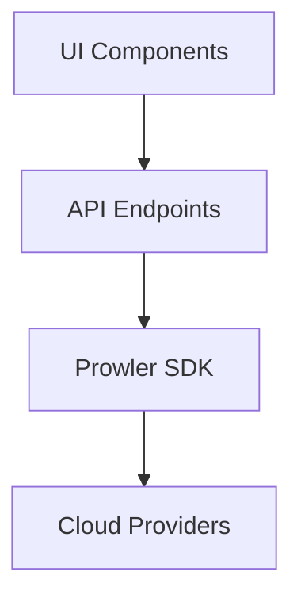
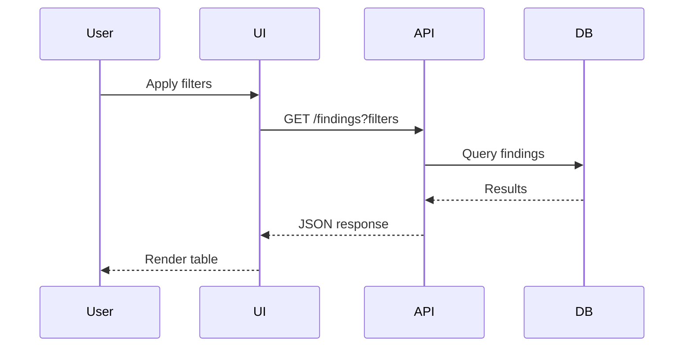
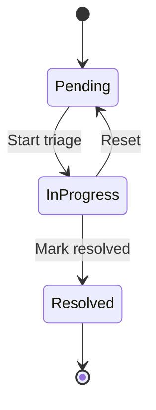
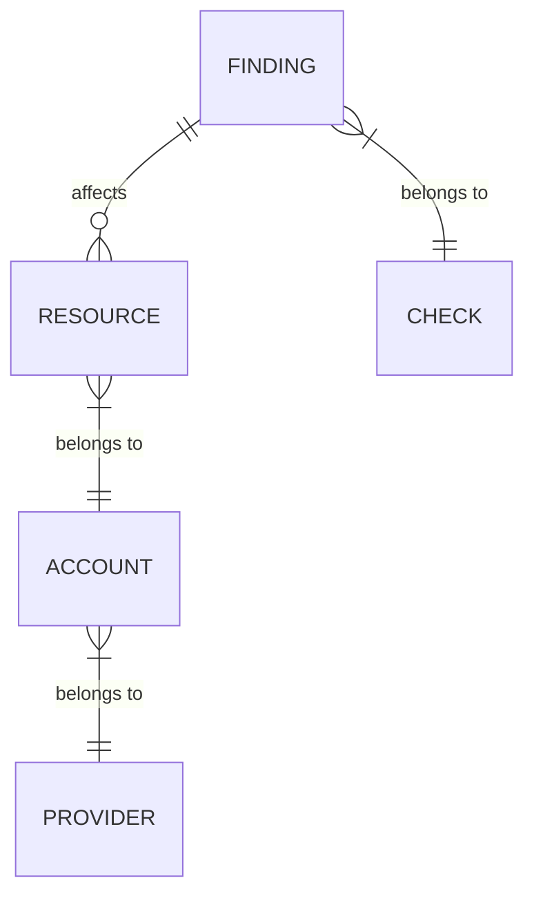

# Pinokio selected skills

This file is generated for this terminal session.

## pinokio
Source: 78b700aeda3a1107

# Pinokio Runtime Skill (pterm-first)

Use this skill for runtime control of Pinokio apps.
Do not ask users to manually install, launch, or call APIs when `pterm` can do it.

## Control Plane

Assume `pterm` is preinstalled and up to date.

### pterm Resolution (External Clients)

If running outside Pinokio's own shell, do not assume `pterm` is on `PATH`.

1. If the client can execute shell commands, first check whether `pterm` already works by name in the current shell.
2. If `pterm` works by name, use that command form for all `pterm` commands in this skill.
3. If `pterm` does not work by name or shell command execution is unavailable, resolve `pterm` via `GET http://127.0.0.1:42000/pinokio/path/pterm`.
4. Read `path` from the response.
5. Normalize the resolved path for the current platform and shell before executing it.
   - On Windows, if the resolved path has no executable Windows extension, prefer a sibling shim such as `.cmd` or `.ps1` when present.
6. Use the working command/path form consistently for all `pterm` commands in this skill.
7. If lookup fails, do not immediately conclude that Pinokio is not running.
8. Distinguish failure modes before stopping:
   - `EPERM` / `EACCES` / sandbox denial to `127.0.0.1:42000`:
     - treat this as a local permission problem, not a missing runtime
     - ask for permission first if the client supports permission prompts, escalation, or tool approval
     - rerun the same probe after permission is granted
     - if permission prompts are unavailable, report that loopback access is blocked by the client/sandbox
   - timeout / connection refused / DNS failure:
     - report that the control plane is unreachable rather than claiming `pterm` is uninstalled
   - HTTP success with missing/empty `path`:
     - continue with fallback path checks below before concluding `pterm` is unavailable
9. If the control-plane probe is blocked or returns an empty path, check common local `pterm` locations:
   - `which pterm` or `where pterm`
10. If a local `pterm` binary exists, normalize it for the current shell/platform, use it, and continue. If later `pterm` commands fail against `127.0.0.1:42000` with permission errors, report a loopback permission issue explicitly.
11. Only report "`pterm` unavailable" when both the command-form probe and the resolved/fallback path checks fail.

Use direct `pterm` commands for control-plane operations:

1. `pterm search "<query>"`
2. `pterm status <app_id>`
3. `pterm run <app_path> [--default <selector>]...`
4. `pterm logs <app_id> --tail 200`
5. `pterm which <command>`
6. `pterm stars` (optional: inspect user-pinned favorites)
7. `pterm star <app_id>` / `pterm unstar <app_id>` (only when user explicitly asks to change preference)
8. `pterm registry search "<query>"` (only after no suitable local result and user approval)
9. `pterm download <uri> [name]` (only after a registry result is selected)

Do not run update commands from this skill.
Use `pterm download` only after local search fails, the user approves registry search, and a registry app is selected.
Once a Pinokio-managed app is selected, treat `pterm` and the launcher-managed interfaces as the source of truth for lifecycle and execution. Do not switch to repo-local CLIs or bundled app binaries unless the user explicitly asks for CLI mode.

## How to use

Follow these sections in order:
1. Use Search App first.
2. Only use Registry Fallback if Search App found no suitable installed app and the user approved it.
3. Then use Run App.
4. Then use API Call Strategy if the app exposes an automatable API.

### 1. Search App

- Resolve by `pterm search`.
- Build one primary query from user intent:
  - explicit app name/vendor if user provided one
  - otherwise 2-4 high-signal capability tokens (example: `tts speech synthesis`)
- Query hygiene:
  - remove duplicate/filler words (`to`, `for`, `use`, `app`, `tool`, `service`)
  - do not send full sentences
- Run primary lookup:
  - if query has 3+ terms: `pterm search "<query>" --mode balanced --min-match 2 --limit 8`
  - if query has 1-2 terms: `pterm search "<query>" --mode balanced --min-match 1 --limit 8`
- If user provided a git URL, extract owner/repo tokens and run `pterm search` with those tokens first.
- Useful-hit threshold:
  - for 3+ term queries: candidate has `matched_terms_count >= 2` (if available)
  - for 1-2 term queries: candidate has `matched_terms_count >= 1` or clear top score
- If no useful hits, run one fallback:
  - `pterm search "<query>" --mode broad --limit 8`
- Deterministic ranking:
  - First, rank by runtime tier:
    - relevant apps with `ready=true`
    - otherwise relevant apps with `running=true`
    - otherwise relevant offline apps
  - Within the selected runtime tier, rank by user preference:
    - exact `app_id`/title match (for explicit app requests)
    - `starred=true`
  - Within that same tier, use the remaining tiebreakers:
    - higher `matched_terms_count` (if available)
    - higher `launch_count_total` (if available)
    - more recent `last_launch_at` (if available)
    - higher `score`
  - Do not choose an offline app over a relevant `ready` or `running` app.
  - Do not choose a non-starred app over a relevant starred app in the same runtime tier unless the starred app is clearly not a useful match.
- If the top candidate is not clearly better than alternatives, ask user once with top 3 candidates.
- If a suitable installed app is found, select it and continue to Run App.

### 2. Registry Fallback

- Only use this section if Search App found no suitable installed app.
- Ask the user once whether to search the Pinokio registry for installable apps.
- Only after the user says yes:
  - run `pterm registry search "<query>"`
  - present the best candidates
  - after the user selects one, run `pterm download <uri>`
  - if `pterm download <uri>` fails with `already exists`, ask the user for a local folder name and retry with `pterm download <uri> <name>`
  - if the user wants a specific local folder name or another copy of the same repo, use `pterm download <uri> <name>`
  - then run the downloaded app with `pterm run <local_app_path_or_name>`
- Do not use `pterm registry search` automatically.
- Do not use `pterm run <url>` for the registry flow.

### 3. Run App

- Once you have a selected local app, use `pterm status`.
- Poll every 2s.
- Use status fields from pterm output:
  - `path`: absolute app path to use with `pterm run`
  - `running`: script is running
  - `ready`: app is reachable/ready
  - `ready_url`: base URL for API calls when available
  - `state`: `offline | starting | online`
- Use `--probe` only for readiness confirmation before first API call (or when status is uncertain).
- Use `--timeout=<ms>` only when you need a non-default probe timeout.
- Treat `offline` as expected before first run.
- If app is offline or not ready, run it:
  - Run `pterm run <app_path>`.
  - If the launcher has no explicit default item or the launch action depends on current menu state, infer one or more ordered selectors from the launcher's current menu and pass them via repeated `--default`.
  - Prefer stable launcher selectors such as `run.js?mode=Default`, then broader fallbacks like `run.js`, then installation fallback like `install.js`.
  - Continue polling with `pterm status <app_id>`.
  - Default startup timeout: 180s.
- Success criteria:
  - `state=online` and `ready=true`
  - if `ready_url` exists, use it as API base URL
  - treat `ready_url` plus a generated or reused client as the default execution path for app functionality
- Failure criteria:
  - timeout before success
  - app drops back to `offline` during startup after a run attempt
  - `pterm run` terminates and status never reaches ready
  - on failure, fetch `pterm logs <app_id> --tail 200` and return:
    - raw log tail
    - short diagnosis

### 4. API Call Strategy (generated once, reused)
- Resolve path roots before writing agent-owned files:
  - prefer the current working directory when it is the active writable task/workspace folder
  - resolve `PINOKIO_HOME` with `pterm home` when fallback global storage is needed
- Generated client location:
  - local default: `<current_working_directory>/pinokio_agent/clients/<app_id>/<operation>.<ext>`
  - fallback: `<PINOKIO_HOME>/agents/clients/<app_id>/<operation>.<ext>`
- Output location:
  - local default: `<current_working_directory>/pinokio_agent/output/<app_id>/...`
  - fallback: `<PINOKIO_HOME>/agents/output/<app_id>/...`
- First run for `<app_id>/<operation>`:
  - inspect docs/code to infer endpoint + payload
  - generate minimal HTTP client file (`js`/`py`/`sh`)
- Later runs:
  - reuse existing generated client file directly
- Regenerate only if request indicates contract mismatch:
  - 404/405 endpoint mismatch
  - 400/422 payload/schema mismatch
  - auth/header mismatch
- Prefer documented/public app APIs exposed by the running launcher.
- Do not execute the app's internal Python/Node/bundled CLI as a fallback when `pterm` has already selected a launcher-managed app.
- If no automatable API exists after the app is running, report that clearly instead of bypassing the launcher with an internal CLI.

## Behavior Rules

- Do not add app-specific hardcoding when user gave only capability (for example "tts").
- Do not guess hidden endpoints when docs/code are unclear; ask one targeted question.
- Do not rewrite launcher files unless user explicitly asked.
- When a task needs a local executable such as `python`, prefer resolving it with `pterm which <command>` before falling back to generic shell discovery.
- Prefer returning full logs over brittle deterministic error parsing.
- REST endpoints may be used for diagnostics only when pterm is unavailable; do not claim full install/launch lifecycle completion without compatible pterm commands.
- Do not keep searching after app selection; move to status/run.
- Do not conflate loopback access failure, sandbox denial, or missing permission with "Pinokio is not running" or "`pterm` is not installed."
- On localhost permission failure, prefer asking for permission over asking the user to manually run commands.
- If `127.0.0.1:42000` is blocked but local `pterm` exists, explicitly tell the user this looks like a client permission/sandbox issue.

## Example A (Capability Only)

User: "Generate TTS from this text: hello world"

1. Use the Search App workflow with `pterm search "tts speech synthesis" --mode balanced --min-match 2 --limit 8`.
2. If a suitable installed app is found, continue to Run App.
3. Otherwise, use the Registry Fallback workflow:
   - ask before `pterm registry search`
   - after selection: `pterm download <uri>`
   - if needed after `already exists`, ask for a local folder name and retry with `pterm download <uri> <name>`
   - then `pterm run <local_app_path_or_name>`
4. Continue with Run App and then API Call Strategy.

## Example B (No Launcher Default)

User: "Launch FaceFusion"

1. Use Search App and then Run App as usual.
2. If launcher menu has no explicit default item, infer ordered selectors from the current launcher menu.
3. Run:
   `pterm run <app_path> --default 'run.js?mode=Default' --default run.js --default install.js`
4. Poll `pterm status <app_id>` until ready.

## gepeto
Source: c9df7b6d1e58404f

# Development Guide for Pinokio Projects

## Non-Negotiable Execution Workflow

To guarantee every contribution follows this guide precisely, obey this checklist **before any edits** and **again before finalizing**. Do not skip or reorder.
1. **AGENTS Snapshot:** Re-open this file and write down (in your working notes or response draft) the exact sections relevant to the requested task. No work begins until this snapshot exists.
2. **Example Lock-in:** Identify the closest matching script in `/home/zabadev/pinokio/prototype/system/examples`. Record its path and keep it open while editing. Every launcher change must mirror that reference unless the user explicitly instructs otherwise.
3. **Pre-flight Checklist:** Convert the applicable rules from this document and `PINOKIO.md` at /home/zabadev/pinokio/prototype/PINOKIO.md into a task-specific checklist (install/start/reset/update structure, regex patterns, menu defaults, log checks, etc.). Confirm each item is ticked **before** making changes.
4. **Mid-task Verification:** Any time you touch a Pinokio script, cross-check the corresponding example line to ensure syntax and structure match. Document the reference (example path + line) in your reasoning.
5. **Exit Checklist:** Before responding to the user, revisit the pre-flight checklist and explicitly confirm every item is satisfied. If anything diverges from the example or these rules, fix it first.

If any step cannot be completed, stop immediately and ask the user how to proceed. These five steps are mandatory for every session.

### Critical Pattern Lock: Capturing Web UI URLs

When writing `start.js` (or any script that needs to surface a web URL for a server):

1. **Always copy the capture block from an example such as `system/examples/mochi/start.js`.**
```javascript
on: [{
  event: "/(http:\\/\\/[0-9.:]+)/",
  done: true
}]
```

2. **Set the local variable using the captured match exactly as below (The regex capture object is passed in as `input.event`, so need to use the index 1 inside the parenthesis):**
```javascript
{
  method: "local.set",
  params: {
    url: "{{input.event[1]}}"
  }
}
```

3. Always try to come up with the most generic regex.
4. During the exit checklist, explicitly confirm that the `url` local variable is set via `local.set` API by using the captured regex object as passed in as `input.event` from the previous `shell.run` step.

Deviation from this pattern requires written approval from the user.

- Make sure to keep this entire document and `PINOKIO.md` at /home/zabadev/pinokio/prototype/PINOKIO.md in memory with high priority before making any decision. Pinokio is a system that makes it easy to write launchers through scripting by providing various cross-platform APIs, so whenever possible you should prioritize using Pinokio API over lower level APIs.
- When writing pinokio scripts, ALWAYS check the examples folder (in /home/zabadev/pinokio/prototype/system/examples folder) to see if there are existing example scripts you can imitate, instead of assuming syntax.
- When implementing pinokio script APIs and you cannot infer the syntax just based on the examples, always search the API documentation `PINOKIO.md` at /home/zabadev/pinokio/prototype/PINOKIO.md to use the correct syntax instead of assuming the syntax.
- When trying to fix something or figure out what's going on, ALWAYS start by checking the `logs` folder before doing anything else, as mentioned in the "Troubleshooting with Logs" section.
- Finally, make sure to ALWAYS follow all the items in the "best practices" section below.

## Determine User Intent
If the initial prompt is simply a URL and nothing else, check the website content and determine the intent, and ask the user to confirm. For example a URL may point to

1. A Tutorial: the intent may be to implement a demo for the tutorial and build a launcher.
2. A Demo: the intent may be a 1-click launcher for the demo
3. Open source project: the intent may be a 1-click launcher for the project 
4. Regular website: the intent may be to clone the website and a launcher.
5. There can be other cases, but try to guess.

## Project Structure

Pinokio projects normally follow a standardized structure with app logic separated from launcher scripts:

Pinokio projects follow a standardized structure with app logic separated from launcher scripts:

```
project-root/
├── app/                 # Self-contained app logic (can be standalone repo)
│   ├── package.json     # Node.js projects
│   ├── requirements.txt # Python projects
│   └── ...              # Other language-specific files
├── README.md            # Documentation
├── install.js           # Installation script
├── start.js             # Launch script
├── update.js            # Update script (for updating the scripts and app logic to the latest)
├── reset.js             # Reset dependencies script
├── pinokio.js           # UI generator script
└── pinokio.json         # Metadata (title, description, icon)
```

- Keep app code in `/app` folder only (never in root)
- Store all launcher files in project root (never in `/app`)
- `/app` folder should be self-contained and publishable


The only exceptions are serverless web apps---purely frontend only web applications that do NOT have a server component and connect to 3rd party API endpoints--in which case the folder structure looks like the following (No need for launcher scripts since the index.html will automatically launch. The only thing needed is the metadata file named pinokio.json):

```
project-root/
├── index.html           # The serverless web app entry point
├── ...
├── README.md            # Documentation
└── pinokio.json         # Metadata (title, description, icon)
```

IMPORTANT: ALWAYS try to follow the best practices in the examples folder (/home/zabadev/pinokio/prototype/system/examples) instead of trying to come up with your own structure. The examples have been optimized for the best user experience.

## Launcher Project Working Directory

- The project working directory for a script is always the same directory as the script location.
- For example, when you run `shell.run` API inside `pinokio/start.js`, the default path for shell execution is `pinokio`.
- If the launcher files are in the project root path, then the default path for shell execution is the project root.
- Therefore, it is important to specify the correct `path` attribute when running `shell.run` API commands.

Example: in the following project structure:

```
project-root/
├── pinokio/                 # Pinokio launcher folder
│    ├── start.js             # Launch script
│    ├── pinokio.js           # UI generator script
│    └── pinokio.json         # Metadata (title, description, icon)
└─── backend/
     ├── requirements.txt          # App dependencies
     └── app.py                    # App code
```

The `pinokio/start.js` should use the correct path `../backend` as the `path` attribute, as follows:

```
{
  run: [{
    ...
  }, {
    method: "shell.run",
    params: {
      message: "python app.py",
      venv: "env",
      path: "../backend"
    }
  }, {
    ...
  }]
}
```

## Development Workflow

### 1. Understanding the Project
- Check `SPEC.md` in project root. If the file exists, use that to learn about the project details (what and how to build)
- If no `SPEC.md` exists, build based on user requirements
### 2. Modifying Existing Launcher Projects
If we are starting with existing launcher script files, work with the existing files instead of coming up with your own.
- **Preserve existing functionality:** Only modify necessary parts
- **Don't touch working scripts:** Unless adding/updating specific commands
- **Follow existing conventions:** Match the style and structure already present
### 3. Try to adopt from examples as much as possible
- If starting from scratch, first determine what type of project you will be building, and then check the examples folder (/home/zabadev/pinokio/prototype/system/examples) to see if you can adopt them instead of coming up everything from scratch.
- Even if there are no relevant examples, check the examples to get inspiration for how you would structure the script files even if you have to write from scratch.
### 4. Writing from scratch as a last resort
If there are relevant examples to adopt from, write the scripts from scratch, but just make sure to follow the requirements in the next section.
### 5. Debugging
When the user reports something is not working, ALWAYS inspect the logs folder to get all the execution logs. For more info on how this works, check the "Troubleshooting with Logs" section below.

## Script Requirements

### 1. 1-click launchable
- The main purpose of Pinokio is to provide an easy interface to invoke commands, which may include launching servers, installing programs, etc. Make sure the final product provides ways to install, launch, reset, and update whatever is needed.

### 2. Write Documentation
- ALWAYS write a documentation. A documentation must be stored as `README.md` in the project root folder, along with the rest of the pinokio launcher script files. A documentation file must contain:
  - What the app does
  - How to use the app
  - API documentation for programmatically accessing the app's main features (Javascript, Python, and Curl)

## Types of launchers
## 1. Launching servers
- When an app requires launching a server, here are the commonly used scripts:
  - `install.js`: a script to install the app
  - `start.js`: a script to start the app
  - `reset.js`: a script to reset all the dependencies installed in the `install.js` step. used if the user wants to restart from scratch
  - `update.js`: a script to update the launcher AND the app in case there are new updates. Involves pulling in the relevant git repositories installed through `install.js` (often it's the script repo and some git repositories cloned through the install steps if any)
  - `pinokio.js`: the launcher script that ties all of the above scripts together by providing a UI that links to these scripts.
  - `pinokio.json`: For metadata

Here's a basic server launcher script example (`start.js`). Unless there's a special reason you need to use another pattern, this is the most recommended pattern. Use this or adopt it as needed, but NEVER try something else unless there's a good reason you should not take this approach:

```javascript
module.exports = {
  // By setting daemon: true, the script keeps running even after all items in the `run` array finishes running. Mandatory for launching servers, since otherwise the shells running the server process will get killed after the scripts finish running.
  daemon: true,
  run: [
    {
      // The "shell.run" API for running a shell session
      method: "shell.run",
      params: {
        // Edit 'venv' to customize the venv folder path
        venv: "env",
        // Edit 'env' to customize environment variables (see documentation)
        env: { },
        // Edit 'path' to customize the path to start the shell from
        path: "app",
        // Edit 'message' to customize the commands, or to run multiple commands
        message: [
          "python app.py",
        ],
        on: [{
          // The regular expression pattern to monitor.
          // Whenever each "event" pattern occurs in the shell terminal, the shell will return,
          // and the script will go onto the next step.
          // The regular expression match object will be passed on to the next step as `input.event`
          // Useful for capturing the URL at which the server is running (in case the server prints some message about where the server is running)
          "event": "/(http:\/\/\\S+)/", 

          // Use "done": true to move to the next step while keeping the shell alive.
          // Use "kill": true to move to the next step after killing the shell.
          "done": true
        }]
      }
    },
    {
      // This step sets the local variable 'url'.
      // This local variable will be used in pinokio.js to display the "Open WebUI" tab when the value is set.
      method: "local.set",
      params: {
        // the input.event is the regular expression match object from the previous step
        // In this example, since the pattern was "/(http:\/\/\\S+)/", input.event[1] will include the exact http url match caputred by the parenthesis.
        // Therefore setting the local variable 'url'
        url: "{{input.event[1]}}"
      }
    }
  ]
}
```

## 2. Launching serverless web apps

- In case of purely static web apps WITHOUT servers or backends (for example an HTML based app that connects to 3rd party servers--either remote or localhost), we do NOT need the launcher scripts.
- In these cases, simply include `index.html` in the project root folder and everything should automatically work. No need for any of the pinokio launcher scripts. (Do 
- You still need to include the metadata file so they show up properly on pinokio:
  - `pinokio.json`: For metadata

## 3. Launching quick scripts without web UI

- In many cases, we may not even need a web UI, but instead just a simple way to run scripts.
- This may include TUI (Terminal User Interface) apps, a simple launcher 
- In these cases, all we need is the launcher file `pinokio.js`, which may link to multiple scripts. In this case, there are no web apps (no serverless apsp, no servers), but instead just the default pinokio launcher UI that calls a bunch of scripts.
- Here are some examples:
  - A pinokio script to toggle the desktop theme between dark and light
    - Write some code (python or javascript or whatever)
    - Write a `toggle.js` pinokio script that executes the code
    - Write a `pinokio.js` launcher script to create a sidebar UI that displays the `toggle.js` so the user can simply click the "toggle" button to toggle back and forth between desktop themes
  - A pinokio script to fetch some file
    - Write some code (python or javascript or whatever)
    - Write a `fetch.js` pinokio script that executes the code
    - Write a `pinokio.js` launcher script to create a sidebar UI that displays the `fetch.js` so the user can simply click the "fetch" button to fetch some data.
- You still need to include the metadata file so they show up properly on pinokio:
  - `pinokio.json`: For metadata

## API

This section lists all the script APIs available on Pinokio. To learn the details of how they are used, you can:
1. Check the examples in the /home/zabadev/pinokio/prototype/system/examples folder
2. Read the `PINOKIO.md` at /home/zabadev/pinokio/prototype/PINOKIO.md further documentation on the full syntax

### Script API

These APIs can be used to describe each step in a pinokio script:
- shell.run: run shell commands
- input: accept user input
- filepicker: accept file upload
- fs.write: write to file
- fs.read: read from file
- fs.copy: copy files
- fs.download: download files
- fs.link: create a symbolic link (or junction on windows) for folders
- fs.open: open the system file explorer at a given path
- fs.cat: print file contents
- jump: jump to a specific step
- local.set: set local variables for the currently running script
- json.set: update a json file
- json.rm: remove keys from a json file
- json.get: get values from a json file
- log: print to the web terminal
- net: make network requests
- notify: display a notification
- script.download: download a script from a git uri
- script.start: start a script
- script.stop: stop a script
- script.return: return values if the current script was called by a caller script, so the caller script can utilize the return value as `input`
- web.open: open a url in web browser
- hf.download: huggingfac-cli download API
### Template variables
The following variables are accessible inside template expressions (example `{{args.command}` in scripts, resulting in dynamic behaviors of scripts:
- input: An input is a variable that gets passed from one RPC call to the next
- args: args is the parameter object that gets passed into the script (via pinokio.js `params`). Unlike `input` which takes the value passed in from the immediately previous step, `args` is a global value that is the same through out the entire script execution.
- local: local variable object that can be set with `local.set` API
- self: refers to the script file itself (which is JSON or JavaScript). For example if `start.js` that's currently running has `daemon: true` set, `{{self.daemon}}` will evaluate to true.
- uri: The current script uri
- port: The next available port. Very useful when you need to launch an app at a specific port without port conflicts.
- cwd: The current script execution folder path
- platform: The current operating system. May be one of the following: `darwin`, `win32`, `linux`
- arch: The current system architecture. May be one of the following: x32, x64, arm, arm64, s390, s390x, mipsel, ia32, mips, ppc, ppc64
- gpus: array of available GPUs on the machine (example: `['apple']`, `['nvidia']`)
- gpu: the first available GPU (example: `nvidia`)
- current: The current variable points to the index of the currently executing instruction within the run array.
- next: The next variable points to the index of the next instruction to be executed. (null if the current instruction is the final instruction in the run array)
- envs: You can access the environment variables of the currently running process with envs object.
- which: Check whether a command exists (example: `{{which('winget')}}`. Can be used in the `when` attribute of a script step to run commands or install first.
- exists: Check whether a file or folder exists at the specified relative path (example: `"when": "{{!exists('app')}}"`). Can be used with the `when` attribute to determine a path's existence and trigger custom logic. Use relative paths and it will resolve automatically to the current execution folder. 
- running: Check whether a script file is running (example: `"when": "{{!running('start.js')}}"`). Can be used with the `when` attribute to determine a path's existence and trigger custom logic. Use relative paths and it will resolve automatically to the current execution folder. 
- os: Pinokio exposes the node.js os module through the os variable.
- path: Pinokio exposes the node.js path module through the os variable (example: `{{path.resolve(...)}}`

## System Capabilities
### Package Management (Use in Order of Preference)
The following package managers come pre-installed with Pinokio, so whenever you need to install a 3rd party binary, remember that these are available. Also, you can assume these are available and include the following package manager commands in Pinokio scripts:
1. **UV** - For Python packages (preferred over pip)
2. **NPM** - For Node.js packages  
3. **Conda** - For cross-platform 3rd party binaries
4. **Brew** - Mac-only fallback when other options unavailable
5. **Git** - Full access to git is available.
**Important:** Include all install commands in the install script for reproducibility.
### HTTPS Proxy Support
- All HTTP servers automatically get HTTPS endpoints
- Convention: `http://localhost:<PORT>` → `https://<PORT>.localhost`
- Full proxy list available at: `http://localhost:2019/config/`
### Pterm Features:
- **Clipboard Access:** Read from or Write to system clipboard via pinokio Pterm CLI (`pterm clipboard` command.)
- **Notifications:** Send desktop alerts via pinokio pterm CLI (`pterm push` command.)
- **Script Testing:** Run launcher scripts via pinokio pterm CLI (`pterm start` command.)
- **File Selection:** Use built-in filepicker for user file/folder input (`pterm filepicker` command.)
- **Git Operations:** Clone repositories, push to GitHub
- **GitHub Integration:** Full GitHub CLI support (`gh` commands)

## Troubleshooting with Logs
Pinokio stores the logs for everything that happened in terminal at the following locations, so you can make use of them to determine what's going on:

### Log Structure
In case there is a `pinokio` folder in the project root folder, you should be able to find the logs folder here:

```
pinokio/
└── logs/   # Direct user interaction logs
    ├── api/     # Launcher script logs (install.js, start.js, etc.)
    ├── dev/     # AI coding tool logs (organized by tool)
    └── shell/   # Direct user interaction logs
```

Otherwise, the `logs` folder should be found at project root:

```
logs/
├── api/     # Launcher script logs (install.js, start.js, etc.)
├── dev/     # AI coding tool logs (organized by tool)
└── shell/   # Direct user interaction logs
```

### Log File Naming
- Unix timestamps for each session
- Special "latest" file contains most recent session logs
- **Default:** Use "latest" files for current issues
- **Historical:** Use timestamped files for pattern analysis and the full history.

## Best practices
### 0. Always reference the logs when debugging
- When the user asks to fix something, ALWAYS check the logs folder first to check what went wrong. Check the "Troubleshooting with Logs" section.
### 1. Shell commands for launching programs
- Launch flags related
  - Try as hard as possible to minimize launch flags and parameters when launching an app. For example, instead of `python app.py --port 8610`, try to do `python app.py` unless really necessary. The only exception is when the only way to launch the app is to specify the flags.
- Launch IP related
  - Always try to find a way to launch servers at 127.0.0.1 or localhost, often by specifying launch flags or using environment variables. Some apps launch apps at 0.0.0.0 by default but we do not want this.
- Launch Port related
  - In case the app itself automatically launches at the next available port by default (for example Gradio does this), do NOT specify port, since it's taken care of by the app itself. Always try to minimize the amount of code.
  - If the install instruction says to launch at a specific port, don't use the hardcoded port they suggest since there's a risk of port conflicts. Instead, use Pinokio's `{{port}}` template expression to automatically get the next available port.
  - For example, if the instruction says `python app.py --port 7860`, don't use that hardcoded port since there might be another app running at that port. Instead, automatically assign the next available port like this: `python app.py --port {{port}}`
  - Note that the `{{port}}` expression always returns the next immediately available port for each step, so if you have multiple steps in a script and use `{{port}}` in multiple steps, the value will be different. So if you want to launch at the next available port and then later reuse that port, you will need to first use `{{port}}` to get the next available port, and save the value in local variable using `local.set`, and then use the `{{local.<variable_name>}}` expression later.
### 2. shell.run API
- When writing `shell.run` API requests, always use relative paths (no absolute paths) for the `path` field. For example, if you need to run a command from `app` folder, the `path` attribute should simply be `app`, instead of its full absolute path.
### 2. Package managers
- When installing python packages, try best to use `uv` instead of `pip` even if the install instruction says to use pip. Instead of `pip install -r requirements.txt`, you can simply use `uv pip install -r requirements.txt` for example. Even if the project's own README says use pip or poetry, first check if there's a way to use uv instead.
- When you need to install some global package, try to use `conda` as much as possible. Even on macs, `brew` should be only used if there are no `conda` options.
### 3. Minimal Always
- If you are starting with existing script files, before modifying, creating, or removing any script files, first look at `pinokio.js` to understand which script files are actually used in the launcher. The only script files used are the ones mentioned in the `pinokio.js` file. The `pinokio.js` file is the file that constructs the UI dynamically.
- Do not create a redundant script file that does something that already exists. Instead modify the existing script file for the feature. For example, do not create an `install.json` file for installation if `install.js` already exists. Instead, modify the `install.js` file.
- Pinokio accepts both JSON and JS script files, so when determining whether a script for a specific purpose already exists, check both JSON and JS files mentioned in the `pinokio.js` file. Do not create script files for rendundant purpose.
- When building launchers for existing projects cloned from a repository, try to stay away from modifying the project folder (the `/home/zabadev/pinokio` folder), even if installations are failing. Instead, try to work around it by creating additional files in the launcher folder, and using those files IN ADDITION to the default project.
  - The only exception when you may need to make changes to the project folder is when the user explicitly wants to modify the existing project. Otherwise if the purpose is to simply write a launcher, the app logic folder should never be touched.
- When running shell commands, take full advantage of the Pinokio `shell.run` API, which provides features like `env`, `venv`, `input`, `path`, `sudo`, `on`, etc. which can greatly reduce the amount of script code.
  - Python apps: Always use virtual environments via `venv` attribute. This attribute automatically creates a venv or uses if it already exists.
### 4. Try to support Cross-platform as much as possible
- Use cross-platform shell commands only.
- This means, prefer to use commands that work on all platforms instead of the current platform.
- If there are no cross platform commands, use Pinokio's template expressions to conditionally use commands depending on `platform`, `arch`, etc.
- Also try to utilize Pinokio Pterm APIs for various cross-platform system features.
- If it is impossible to implement a cross platform solution (due to the nature of the project itself), set the `platform`, `arch`, and/or `gpu` attributes of the `pinokio.json` file to declare the limitation.
- Pinokio provides various APIs for cross-platform way of calling commonly used system functions, or lets you selectively run commands depending on `platform`, `arch`, etc.
### 5. Do not make assumptions about Pinokio API
- Do NOT make assumptions about which Pinokio APIs exist. Check the documentation.
- Do NOT make assumptions about the Pinokio API syntax. Follow the documentation.
### 6. Scripts must be able to replicate install and launch steps 100%
- The whole point of the scripts is for others to easily download and invoke them via Pinokio interface with one click. Therefore, do not assume the end user's system state, and make everything self-contained.
- When a 3rd party package needs to be installed, or a 3rd party repository needs to be downloaded, include them in the scripts.
### 7 Dynamic UI rendering
- The `pinokio.js` launcher script can change dynamically depending on the current state of the script execution. Which means, depending on what the file returns, it can determine what the sidebar looks like at any given moment of the script cycle.
  - `info.exists(relative_path)`: The `info.exists` can be used to check whether a relative path (relative to the script root path) exists. The `pinokio.js` file can determine which menu items to return based on this value at any given moment.
  - `info.running(relative_path)`: The `info.running` can be used to check whether a script at a relative path is currently running (relative to the script root path) exists. The `pinokio.js` file can determine which menu items to return based on this value at any given moment.
  - `info.local(relative_path)`: The `info.local` can be used to return all the local variables tied to a script that's currently running. The `pinokio.js` file can determine which menu items to return based on this value at any given moment.
  - `default`: set the `default` attribute on any menu item for whichever menu needs to be selected by default at a given step. Some example scenarios:
    - during the install process, the `install.js` menu item needs to be set as the `default`, so it automatically executes the script
    - when launching the `start.js` menu item needs to be set as the `default`, so it automatically executes the script
    - after the app has launched, the `default` needs to be set on the web UI URL, so the user is sent to the actual app automatically.
  - Check the examples in the /home/zabadev/pinokio/prototype/system/examples folder to see how these are being used.
### 8. No need for stop scripts
- `pinokio.js` does NOT need a separate `stop` script. Every script that can be started can also be natively stopped through the Pinokio UI, therefore you do not need a separate stop script for start script
### 9. Writing launchers for existing projects
- When writing or modifying pinokio launcher scripts, figure out the install/launch steps by reading the project folder `app`.
- In most cases, the `README.md` file in the `/home/zabadev/pinokio` folder contains the instructions needed to install and run the app, but if not, figure out by scanning the rest of the project files.
- Install scripts should work for each specific operating system, so ignore Docker related instructions. Instead use install/launch instructions for each platform.
### 10. Don't use Docker unless really necessary
- Some projects suggest docker as installation options. But even in these cases, try to find "development" options to launch the app without relying on Docker, as much as possible. We do not need Docker since we can automatically install and launch apps specifically for the user's platform, since we can write scripts that run cross platform.
### 11. pinokio.json
- Do not touch the `version` field since the version is the script schema version and the one pre-set in `pinokio.js` must be used.
- `icon`: It's best if we have a user friendly icon to represent the app, so try to get an image and link it from `pinokio.json`.
  - If the git repository for the `/home/zabadev/pinokio` folder points to GitHub (for example https://github.com/<USERNAME>/<REPO_NAME>`, ask the user if they want to download the icon from GitHub, and if approved, get the `avatar_url` by fetching `https://api.github.com/users/<USERNAME>`, and then download the image to the root folder as `icon.png`, and set `icon.png` as the `icon` field of the `pinokio.json`. 
### 12. Gitignore
- When a launcher involves cloning 3rd party repositories, downloading files dynamically, or some files to be generated, these need to be included in the .gitignore file. This may include things like:
  - Cloning git repositories
  - Downloading files
  - Dynamically creating files during installation or running, such as Sqlite Databases, or environment variables, or anything specific to the user.
- Make sure these file paths are included in the .gitignore file, and if not, include them in .gitignore.

## AI Libraries (Pytorch, Xformers, Triton, Sageattention, etc.)
If the launcher has a dedicated built-in script named `torch.js`, it can be used as follows:

```
// install.js
module.exports = {
  run: [
    // Edit this step with your custom install commands
    {
      method: "shell.run",
      params: {
        venv: "venv",                // Edit this to customize the venv folder path
        path: "app",
        message: [
          "uv pip install -r requirements.txt"
        ],
      }
    },
    // Delete this step if your project does not use torch
    {
      method: "script.start",
      params: {
        uri: "torch.js",
        params: {
          path: "app",
          venv: "venv",                // Edit this to customize the venv folder path
          // xformers: true   // uncomment this line if your project requires xformers
          // triton: true   // uncomment this line if your project requires triton
          // sageattention: true   // uncomment this line if your project requires sageattention
          // flashattention: true   // uncomment this line if your project requires flashattention
        }
      }
    },
  ]
}
```

The `torch.js` script also includes ways to install pytorch dependent libraries such as xformers, triton, sagetattention. If any of these libraries need to be installed, use the torch.js to install in order to install them cross platform.


## Quick Reference
### Essential Documentation
- **Pinokio Programming:** See `PINOKIO.md` at /home/zabadev/pinokio/prototype/PINOKIO.md → "Programming Pinokio" section
- **Dynamic Menus:** See `PINOKIO.md` at /home/zabadev/pinokio/prototype/PINOKIO.md → "Dynamic menu rendering" section  
- **CLI Commands:** See `PTERM.md` at /home/zabadev/pinokio/prototype/PTERM.md
### Common Patterns
- **Python Virtual Env:** `shell.run` with `venv` attribute
- **Cross-platform Commands:** Always test on multiple platforms
- **Error Handling:** Check logs/api for launcher issues
- **GitHub Operations:** Use `gh` CLI for advanced GitHub features
## Development Principles
1. **Minimize Shell Usage:** Leverage API parameters instead of raw commands
2. **Maintain Separation:** Keep app logic and launchers separate
3. **Follow Conventions:** Match existing project patterns
4. **Test Thoroughly:** Use CLI to verify launcher functionality
5. **Document Changes:** Update relevant metadata and documentation

## pytest
Source: 3275078452aebe49

## Basic Test Structure

```python
import pytest

class TestUserService:
    def test_create_user_success(self):
        user = create_user(name="John", email="john@test.com")
        assert user.name == "John"
        assert user.email == "john@test.com"

    def test_create_user_invalid_email_fails(self):
        with pytest.raises(ValueError, match="Invalid email"):
            create_user(name="John", email="invalid")
```

## Fixtures

```python
import pytest

@pytest.fixture
def user():
    """Create a test user."""
    return User(name="Test User", email="test@example.com")

@pytest.fixture
def authenticated_client(client, user):
    """Client with authenticated user."""
    client.force_login(user)
    return client

# Fixture with teardown
@pytest.fixture
def temp_file():
    path = Path("/tmp/test_file.txt")
    path.write_text("test content")
    yield path  # Test runs here
    path.unlink()  # Cleanup after test

# Fixture scopes
@pytest.fixture(scope="module")  # Once per module
@pytest.fixture(scope="class")   # Once per class
@pytest.fixture(scope="session") # Once per test session
```

## conftest.py

```python
# tests/conftest.py - Shared fixtures
import pytest

@pytest.fixture
def db_session():
    session = create_session()
    yield session
    session.rollback()

@pytest.fixture
def api_client():
    return TestClient(app)
```

## Mocking

```python
from unittest.mock import patch, MagicMock

class TestPaymentService:
    def test_process_payment_success(self):
        with patch("services.payment.stripe_client") as mock_stripe:
            mock_stripe.charge.return_value = {"id": "ch_123", "status": "succeeded"}

            result = process_payment(amount=100)

            assert result["status"] == "succeeded"
            mock_stripe.charge.assert_called_once_with(amount=100)

    def test_process_payment_failure(self):
        with patch("services.payment.stripe_client") as mock_stripe:
            mock_stripe.charge.side_effect = PaymentError("Card declined")

            with pytest.raises(PaymentError):
                process_payment(amount=100)

# MagicMock for complex objects
def test_with_mock_object():
    mock_user = MagicMock()
    mock_user.id = "user-123"
    mock_user.name = "Test User"
    mock_user.is_active = True

    result = get_user_info(mock_user)
    assert result["name"] == "Test User"
```

## Parametrize

```python
@pytest.mark.parametrize("input,expected", [
    ("hello", "HELLO"),
    ("world", "WORLD"),
    ("pytest", "PYTEST"),
])
def test_uppercase(input, expected):
    assert input.upper() == expected

@pytest.mark.parametrize("email,is_valid", [
    ("user@example.com", True),
    ("invalid-email", False),
    ("", False),
    ("user@.com", False),
])
def test_email_validation(email, is_valid):
    assert validate_email(email) == is_valid
```

## Markers

```python
# pytest.ini or pyproject.toml
[tool.pytest.ini_options]
markers = [
    "slow: marks tests as slow",
    "integration: marks integration tests",
]

# Usage
@pytest.mark.slow
def test_large_data_processing():
    ...

@pytest.mark.integration
def test_database_connection():
    ...

@pytest.mark.skip(reason="Not implemented yet")
def test_future_feature():
    ...

@pytest.mark.skipif(sys.platform == "win32", reason="Unix only")
def test_unix_specific():
    ...

# Run specific markers
# pytest -m "not slow"
# pytest -m "integration"
```

## Async Tests

```python
import pytest

@pytest.mark.asyncio
async def test_async_function():
    result = await async_fetch_data()
    assert result is not None
```

## Commands

```bash
pytest                          # Run all tests
pytest -v                       # Verbose output
pytest -x                       # Stop on first failure
pytest -k "test_user"           # Filter by name
pytest -m "not slow"            # Filter by marker
pytest --cov=src                # With coverage
pytest -n auto                  # Parallel (pytest-xdist)
pytest --tb=short               # Short traceback
```

## Keywords
pytest, python, testing, fixtures, mocking, parametrize, markers

## pr-review
Source: e32797f4f2d25475

## When to Use

**ALWAYS use this skill when user mentions "pr review", "revisar PRs", or asks about pending PRs/issues** - even if they first ask what's pending. This skill handles the FULL flow: listing → analyzing → reviewing.

Specific triggers:
- User wants to review PRs (even if first asking what's open)
- Analyze issues or contributions
- Audit PR/issue backlog
- Check what needs attention

**Key phrases:** "pr review", "revisar", "qué hay pendiente", "sin atención", "PRs abiertos", "issues abiertos", "hacer review", "necesito revisar"

## Review Process

### Phase 1: Gather Information

```bash
# List all issues and PRs
gh issue list --state all --limit 20
gh pr list --state all --limit 20

# Get PR details (run in parallel)
gh pr view {number} --json title,body,files,additions,deletions,author
gh pr diff {number} --patch
```

### Phase 2: Load Project Skills (MANDATORY)

Before reviewing ANY code, check if the repo has project-specific skills that define conventions. These are your review criteria — not just generic best practices.

**How to find them:**
1. Check `AGENTS.md` at the repo root — it lists all available skills and auto-invoke rules
2. Check `skills/` directory for project-specific skill files
3. If the repo has an `AGENTS.md` with an Auto-invoke Skills table, read it

**For each PR, load the skills that match the changed files:**

| Files Changed | Skills to Load |
|---------------|----------------|
| `api/` (models, views, serializers) | project API skill + `django-drf` |
| `api/` (tests) | project API test skill + `pytest` |
| `ui/` (components, pages) | project UI skill + `react-19` + `nextjs-15` + `tailwind-4` |
| `ui/` (tests) | project UI test skill + `playwright` |
| `ui/` (schemas) | `zod-4` |
| `ui/` (stores) | `zustand-5` |
| Types/interfaces | `typescript` |

**Review against project conventions, not just general quality.** Check:
- Does the file structure match what the project skill defines?
- Are naming conventions followed? (serializer names, component placement, test structure)
- Are the right patterns used? (service layer vs serializer logic, Server Components vs Client)
- Do tests follow the project's test patterns? (fixtures, assertions, POM for E2E)

If no project skills exist, fall back to generic best practices.

### Phase 3: Read Current Codebase

Before reviewing diffs, **always read the current code** to understand context:
- Main entry points
- Files being modified
- Related modules

### Phase 4: Analyze Each PR

For each PR, evaluate these factors:

| Factor | What to Check |
|--------|---------------|
| **Project Conventions** | Does it follow the project skills? Structure, naming, patterns |
| **Code Quality** | Clean code, no duplication, proper error handling |
| **Tests** | Are there tests? Do they follow the project's test patterns? |
| **Breaking Changes** | Does it break existing functionality? |
| **Conflicts** | Will it conflict with other open PRs? |
| **Commit Hygiene** | Clean history, no test files, proper messages |
| **Documentation** | README updated if needed, comments where necessary |

## Critical Patterns

### Red Flags (DO NOT MERGE)

- [ ] Test/debug files committed (`test.js`, `console.log`, etc.)
- [ ] Variables declared but never used
- [ ] Code duplication instead of refactoring
- [ ] Broken indentation or syntax errors
- [ ] Config files with personal/local settings
- [ ] Hardcoded secrets or credentials
- [ ] Breaking changes without migration path

### Yellow Flags (Request Changes)

- [ ] Too many commits (should squash)
- [ ] Missing validation for dependencies (e.g., `jq`, `curl`)
- [ ] Potential conflicts with other PRs
- [ ] Incomplete feature (e.g., variable declared but not used)
- [ ] Fallback code with bugs (e.g., not escaping newlines)

### Green Flags (Good to Merge)

- [x] Small, focused changes
- [x] Tests included
- [x] Clean commit history (1-3 commits)
- [x] Documentation updated
- [x] No conflicts with other PRs
- [x] Solves a real issue

## Decision Matrix

```
Has red flags?           → DO NOT MERGE, request fixes
Has yellow flags only?   → Request changes, can merge after fixes
All green?               → MERGE
```

## Output Format

### For Issues

```markdown
## Issues Analysis

### Good Issues (Valid, should be addressed)
| # | Issue | Analysis |
|---|-------|----------|
| **#XX** | Title | Why it's valid |

### Questionable Issues
| # | Issue | Analysis |
|---|-------|----------|
| **#XX** | Title | Problems with this issue |

### Should Close
| # | Issue | Reason |
|---|-------|--------|
| **#XX** | Title | Why it should be closed |
```

### For PRs

```markdown
## PR Analysis

### Ready to Merge
| PR | Author | Why it's ready |
|----|--------|----------------|
| **#XX** | @user | Brief explanation |

### Needs Work
| PR | Author | What to fix |
|----|--------|-------------|
| **#XX** | @user | List of issues |

### Do Not Merge
| PR | Author | Critical problems |
|----|--------|-------------------|
| **#XX** | @user | Why it can't be merged |
```

## Review Comments

### Language Rules

**Reply in the same language the author used in their PR/issue:**
- PR written in Spanish → Reply in Spanish
- PR written in English → Reply in English

### Comment Style: Concise & Human

Write review comments like a senior engineer talking to a colleague — direct, clear, no fluff. NOT like a template.

**Rules:**
- Lead with the issues, numbered. No greetings, no "Hey {Name}!".
- Each issue: **bold the problem** in one phrase, then explain in 1-2 plain sentences. Include the concrete fix inline.
- End with 1-2 sentences acknowledging what's good. Don't force it — only if something genuinely stood out.
- No emojis in the review body. No `##` headings. No horizontal rules. Just numbered points and a closing line.
- No "Solution" sections — the fix goes inline with the issue description.
- Keep it short. If you can say it in one sentence, don't use two.

### Approve Format

One sentence — what's good, ship it. Optionally a follow-up note.

```
Clean refactor, all spec requirements covered, 28 tests. Ship it.
```

```
Well done. Service layer pattern, anti-enumeration, rate limiting, 32 tests. Synchronous email is fine for MVP.
```

```
Solid. Fire-and-forget with proper timeouts, 5 tests. One note: the spec still says single-field payload but code sends {type, data} — code is better, update the spec in a follow-up.
```

### Request Changes Format

```
Two things to address:

1. **UpdateModelMixin exposes PUT** — you only need PATCH here. Add `http_method_names = ["get", "patch", "head", "options"]` to the ViewSet so PUT isn't accidentally exposed.

2. **partner_id in refresh token** — `get_token()` adds partner_id to the refresh token, and the access inherits from it, so it ends up in both. The design doc says access only. Either move the claim injection to `validate()` on the access token, or update the design doc if you're ok with it being in both.

Everything else looks solid — sign-in guards correctly use 403, is_staff is in the serializer, tests are thorough. Nice work on the service layer separation.
```

```
One thing — in partner-kickoff/SKILL.md, the Step 5 heading is sitting between Step 9 and Step 11. Looks like it didn't get renumbered when the workflow was restructured. Move it to the right position or renumber.

The verify skill itself is well-structured — clear verdict rules, good fresh-context pattern.
```

### Anti-patterns to AVOID

- "Hey John! Thanks for the PR, the analysis is well done" — skip the greeting, get to the point
- "## Problem Category" / "## Solution" headings — too formal, use numbered list
- Long code blocks showing the fix — one line inline is enough
- "Great job! Just a few minor things..." — empty praise before criticism
- Emojis anywhere in the review body
- Repeating what the PR description already says

## Commands

```bash
# Merge a PR (after approval)
gh pr merge {number} --merge

# Leave a review comment
gh pr review {number} --comment --body "$(cat <<'EOF'
{comment content}
EOF
)"

# Request changes
gh pr review {number} --request-changes --body "..."

# Approve
gh pr review {number} --approve --body "..."

# Close issue as not planned
gh issue close {number} --reason "not planned" --comment "..."
```

## Conflict Detection

When reviewing multiple PRs, check for conflicts:

1. **Same files modified** - Check if PRs touch the same files
2. **Dependent features** - PR A adds feature, PR B extends it
3. **Version bumps** - Multiple PRs changing VERSION
4. **Provider patterns** - New providers need to be added to all switch/case statements

### Common Conflict Pattern: Provider Addition

When a PR adds timeout/wrapper logic with hardcoded providers:
```bash
case "$provider" in
  claude) ...
  gemini) ...
  *) echo "Unknown" ;;  # New providers will fail!
esac
```

**Flag this** - any PR adding new providers will conflict.

## Merge Order Strategy

When multiple PRs have dependencies:

1. **Independent, small PRs first** - Quick wins, no conflicts
2. **Infrastructure PRs second** - Timeout, error handling, etc.
3. **Feature PRs third** - New providers, modes, etc.
4. **Large refactors last** - Most likely to have conflicts

## Checklist Before Merging

- [ ] All tests pass (if CI exists)
- [ ] No red flags in code
- [ ] No conflicts with recently merged PRs
- [ ] Author's branch is up to date with main
- [ ] Review comments addressed (if any)

## playwright
Source: 938209e375c58b74

## MCP Workflow (MANDATORY If Available)

**⚠️ If you have Playwright MCP tools, ALWAYS use them BEFORE creating any test:**

1. **Navigate** to target page
2. **Take snapshot** to see page structure and elements
3. **Interact** with forms/elements to verify exact user flow
4. **Take screenshots** to document expected states
5. **Verify page transitions** through complete flow (loading, success, error)
6. **Document actual selectors** from snapshots (use real refs and labels)
7. **Only after exploring** create test code with verified selectors

**If MCP NOT available:** Proceed with test creation based on docs and code analysis.

**Why This Matters:**
- ✅ Precise tests - exact steps needed, no assumptions
- ✅ Accurate selectors - real DOM structure, not imagined
- ✅ Real flow validation - verify journey actually works
- ✅ Avoid over-engineering - minimal tests for what exists
- ✅ Prevent flaky tests - real exploration = stable tests
- ❌ Never assume how UI "should" work

## File Structure

```
tests/
├── base-page.ts              # Parent class for ALL pages
├── helpers.ts                # Shared utilities
└── {page-name}/
    ├── {page-name}-page.ts   # Page Object Model
    ├── {page-name}.spec.ts   # ALL tests here (NO separate files!)
    └── {page-name}.md        # Test documentation
```

**File Naming:**
- ✅ `sign-up.spec.ts` (all sign-up tests)
- ✅ `sign-up-page.ts` (page object)
- ✅ `sign-up.md` (documentation)
- ❌ `sign-up-critical-path.spec.ts` (WRONG - no separate files)
- ❌ `sign-up-validation.spec.ts` (WRONG)

## Selector Priority (REQUIRED)

```typescript
// 1. BEST - getByRole for interactive elements
this.submitButton = page.getByRole("button", { name: "Submit" });
this.navLink = page.getByRole("link", { name: "Dashboard" });

// 2. BEST - getByLabel for form controls
this.emailInput = page.getByLabel("Email");
this.passwordInput = page.getByLabel("Password");

// 3. SPARINGLY - getByText for static content only
this.errorMessage = page.getByText("Invalid credentials");
this.pageTitle = page.getByText("Welcome");

// 4. LAST RESORT - getByTestId when above fail
this.customWidget = page.getByTestId("date-picker");

// ❌ AVOID fragile selectors
this.button = page.locator(".btn-primary");  // NO
this.input = page.locator("#email");         // NO
```

## Scope Detection (ASK IF AMBIGUOUS)

| User Says | Action |
|-----------|--------|
| "a test", "one test", "new test", "add test" | Create ONE test() in existing spec |
| "comprehensive tests", "all tests", "test suite", "generate tests" | Create full suite |

**Examples:**
- "Create a test for user sign-up" → ONE test only
- "Generate E2E tests for login page" → Full suite
- "Add a test to verify form validation" → ONE test to existing spec

## Page Object Pattern

```typescript
import { Page, Locator, expect } from "@playwright/test";

// BasePage - ALL pages extend this
export class BasePage {
  constructor(protected page: Page) {}

  async goto(path: string): Promise<void> {
    await this.page.goto(path);
    await this.page.waitForLoadState("networkidle");
  }

  // Common methods go here (see Refactoring Guidelines)
  async waitForNotification(): Promise<void> {
    await this.page.waitForSelector('[role="status"]');
  }

  async verifyNotificationMessage(message: string): Promise<void> {
    const notification = this.page.locator('[role="status"]');
    await expect(notification).toContainText(message);
  }
}

// Page-specific implementation
export interface LoginData {
  email: string;
  password: string;
}

export class LoginPage extends BasePage {
  readonly emailInput: Locator;
  readonly passwordInput: Locator;
  readonly submitButton: Locator;

  constructor(page: Page) {
    super(page);
    this.emailInput = page.getByLabel("Email");
    this.passwordInput = page.getByLabel("Password");
    this.submitButton = page.getByRole("button", { name: "Sign in" });
  }

  async goto(): Promise<void> {
    await super.goto("/login");
  }

  async login(data: LoginData): Promise<void> {
    await this.emailInput.fill(data.email);
    await this.passwordInput.fill(data.password);
    await this.submitButton.click();
  }

  async verifyCriticalOutcome(): Promise<void> {
    await expect(this.page).toHaveURL("/dashboard");
  }
}
```

## Page Object Reuse (CRITICAL)

**Always check existing page objects before creating new ones!**

```typescript
// ✅ GOOD: Reuse existing page objects
import { SignInPage } from "../sign-in/sign-in-page";
import { HomePage } from "../home/home-page";

test("User can sign up and login", async ({ page }) => {
  const signUpPage = new SignUpPage(page);
  const signInPage = new SignInPage(page);  // REUSE
  const homePage = new HomePage(page);      // REUSE

  await signUpPage.signUp(userData);
  await homePage.verifyPageLoaded();  // REUSE method
  await homePage.signOut();           // REUSE method
  await signInPage.login(credentials); // REUSE method
});

// ❌ BAD: Recreating existing functionality
export class SignUpPage extends BasePage {
  async logout() { /* ... */ }  // ❌ HomePage already has this
  async login() { /* ... */ }   // ❌ SignInPage already has this
}
```

**Guidelines:**
- Check `tests/` for existing page objects first
- Import and reuse existing pages
- Create page objects only when page doesn't exist
- If test requires multiple pages, ensure all page objects exist (create if needed)

## Refactoring Guidelines

### Move to `BasePage` when:
- ✅ Navigation helpers used by multiple pages (`waitForPageLoad()`, `getCurrentUrl()`)
- ✅ Common UI interactions (notifications, modals, theme toggles)
- ✅ Verification patterns repeated across pages (`isVisible()`, `waitForVisible()`)
- ✅ Error handling that applies to all pages
- ✅ Screenshot utilities for debugging

### Move to `helpers.ts` when:
- ✅ Test data generation (`generateUniqueEmail()`, `generateTestUser()`)
- ✅ Setup/teardown utilities (`createTestUser()`, `cleanupTestData()`)
- ✅ Custom assertions (`expectNotificationToContain()`)
- ✅ API helpers for test setup (`seedDatabase()`, `resetState()`)
- ✅ Time utilities (`waitForCondition()`, `retryAction()`)

**Before (BAD):**
```typescript
// Repeated in multiple page objects
export class SignUpPage extends BasePage {
  async waitForNotification(): Promise<void> {
    await this.page.waitForSelector('[role="status"]');
  }
}
export class SignInPage extends BasePage {
  async waitForNotification(): Promise<void> {
    await this.page.waitForSelector('[role="status"]');  // DUPLICATED!
  }
}
```

**After (GOOD):**
```typescript
// BasePage - shared across all pages
export class BasePage {
  async waitForNotification(): Promise<void> {
    await this.page.waitForSelector('[role="status"]');
  }
}

// helpers.ts - data generation
export function generateUniqueEmail(): string {
  return `test.${Date.now()}@example.com`;
}

export function generateTestUser() {
  return {
    name: "Test User",
    email: generateUniqueEmail(),
    password: "TestPassword123!",
  };
}
```

## Test Pattern with Tags

```typescript
import { test, expect } from "@playwright/test";
import { LoginPage } from "./login-page";

test.describe("Login", () => {
  test("User can login successfully",
    { tag: ["@critical", "@e2e", "@login", "@LOGIN-E2E-001"] },
    async ({ page }) => {
      const loginPage = new LoginPage(page);

      await loginPage.goto();
      await loginPage.login({ email: "user@test.com", password: "pass123" });

      await expect(page).toHaveURL("/dashboard");
    }
  );
});
```

**Tag Categories:**
- Priority: `@critical`, `@high`, `@medium`, `@low`
- Type: `@e2e`
- Feature: `@signup`, `@signin`, `@dashboard`
- Test ID: `@SIGNUP-E2E-001`, `@LOGIN-E2E-002`

## Test Documentation Format ({page-name}.md)

```markdown
### E2E Tests: {Feature Name}

**Suite ID:** `{SUITE-ID}`
**Feature:** {Feature description}

---

## Test Case: `{TEST-ID}` - {Test case title}

**Priority:** `{critical|high|medium|low}`

**Tags:**
- type → @e2e
- feature → @{feature-name}

**Description/Objective:** {Brief description}

**Preconditions:**
- {Prerequisites for test to run}
- {Required data or state}

### Flow Steps:
1. {Step 1}
2. {Step 2}
3. {Step 3}

### Expected Result:
- {Expected outcome 1}
- {Expected outcome 2}

### Key verification points:
- {Assertion 1}
- {Assertion 2}

### Notes:
- {Additional considerations}
```

**Documentation Rules:**
- ❌ NO general test running instructions
- ❌ NO file structure explanations
- ❌ NO code examples or tutorials
- ❌ NO troubleshooting sections
- ✅ Focus ONLY on specific test case
- ✅ Keep under 60 lines when possible

## Commands

```bash
npx playwright test                    # Run all
npx playwright test --grep "login"     # Filter by name
npx playwright test --ui               # Interactive UI
npx playwright test --debug            # Debug mode
npx playwright test tests/login/       # Run specific folder
```

## Keywords
playwright, e2e, testing, page object model, selectors, end-to-end, mcp

## nextjs-15
Source: 327cd81e62d1578d

## App Router File Conventions

```
app/
├── layout.tsx          # Root layout (required)
├── page.tsx            # Home page (/)
├── loading.tsx         # Loading UI (Suspense)
├── error.tsx           # Error boundary
├── not-found.tsx       # 404 page
├── (auth)/             # Route group (no URL impact)
│   ├── login/page.tsx  # /login
│   └── signup/page.tsx # /signup
├── api/
│   └── route.ts        # API handler
└── _components/        # Private folder (not routed)
```

## Server Components (Default)

```typescript
// No directive needed - async by default
export default async function Page() {
  const data = await db.query();
  return <Component data={data} />;
}
```

## Server Actions

```typescript
// app/actions.ts
"use server";

import { revalidatePath } from "next/cache";
import { redirect } from "next/navigation";

export async function createUser(formData: FormData) {
  const name = formData.get("name") as string;

  await db.users.create({ data: { name } });

  revalidatePath("/users");
  redirect("/users");
}

// Usage
<form action={createUser}>
  <input name="name" required />
  <button type="submit">Create</button>
</form>
```

## Data Fetching

```typescript
// Parallel
async function Page() {
  const [users, posts] = await Promise.all([
    getUsers(),
    getPosts(),
  ]);
  return <Dashboard users={users} posts={posts} />;
}

// Streaming with Suspense
<Suspense fallback={<Loading />}>
  <SlowComponent />
</Suspense>
```

## Route Handlers (API)

```typescript
// app/api/users/route.ts
import { NextRequest, NextResponse } from "next/server";

export async function GET(request: NextRequest) {
  const users = await db.users.findMany();
  return NextResponse.json(users);
}

export async function POST(request: NextRequest) {
  const body = await request.json();
  const user = await db.users.create({ data: body });
  return NextResponse.json(user, { status: 201 });
}
```

## Middleware

```typescript
// middleware.ts (root level)
import { NextResponse } from "next/server";
import type { NextRequest } from "next/server";

export function middleware(request: NextRequest) {
  const token = request.cookies.get("token");

  if (!token && request.nextUrl.pathname.startsWith("/dashboard")) {
    return NextResponse.redirect(new URL("/login", request.url));
  }

  return NextResponse.next();
}

export const config = {
  matcher: ["/dashboard/:path*"],
};
```

## Metadata

```typescript
// Static
export const metadata = {
  title: "My App",
  description: "Description",
};

// Dynamic
export async function generateMetadata({ params }) {
  const product = await getProduct(params.id);
  return { title: product.name };
}
```

## server-only Package

```typescript
import "server-only";

// This will error if imported in client component
export async function getSecretData() {
  return db.secrets.findMany();
}
```

## Keywords
nextjs, next.js, app router, server components, server actions, streaming

## jira-task
Source: 618976ff74d50ce5

## When to Use

Use this skill when creating Jira tasks for:
- Bug reports
- Feature requests
- Refactoring tasks
- Documentation tasks

## Multi-Component Work: Split into Multiple Tasks

**IMPORTANT:** When work requires changes in multiple components (API, UI, SDK), create **separate tasks for each component** instead of one big task.

### Why Split?
- Different developers can work in parallel
- Easier to review and test
- Better tracking of progress
- API needs to be done before UI (dependency)

### Bug vs Feature: Different Structures

#### For BUGS: Create separate sibling tasks
Bugs are typically urgent fixes, so create independent tasks per component:

**Task 1 - API:**
- Title: `[BUG] Add aws_region field to AWS provider secrets (API)`
- Must be done first (UI depends on it)

**Task 2 - UI:**
- Title: `[BUG] Add region selector to AWS provider connection form (UI)`
- Blocked by API task

#### For FEATURES: Create parent + child tasks
Features need business context for stakeholders, so use a parent-child structure:

**Parent Task (for PM/Stakeholders):**
- Title: `[FEATURE] AWS GovCloud support`
- Contains: Feature overview, user story, acceptance criteria from USER perspective
- NO technical details
- Links to child tasks

**Child Task 1 - API:**
- Title: `[FEATURE] AWS GovCloud support (API)`
- Contains: Technical details, affected files, API-specific acceptance criteria
- Links to parent

**Child Task 2 - UI:**
- Title: `[FEATURE] AWS GovCloud support (UI)`
- Contains: Technical details, component paths, UI-specific acceptance criteria
- Links to parent, blocked by API task

### Parent Task Template (Features Only)

```markdown
## Description

{User-facing description of the feature - what problem does it solve?}

## User Story

As a {user type}, I want to {action} so that {benefit}.

## Acceptance Criteria (User Perspective)

- [ ] User can {do something}
- [ ] User sees {something}
- [ ] {Behavior from user's point of view}

## Out of Scope

- {What this feature does NOT include}

## Design

- Figma: {link if available}
- Screenshots/mockups if available

## Child Tasks

- [ ] `[FEATURE] {Feature name} (API)` - Backend implementation
- [ ] `[FEATURE] {Feature name} (UI)` - Frontend implementation

## Priority

{High/Medium/Low} ({business justification})
```

### Child Task Template (Features Only)

```markdown
## Description

Technical implementation of {feature name} for {component}.

## Parent Task

`[FEATURE] {Feature name}`

## Acceptance Criteria (Technical)

- [ ] {Technical requirement 1}
- [ ] {Technical requirement 2}

## Technical Notes

- Affected files:
  - `{file path 1}`
  - `{file path 2}`
- {Implementation hints}

## Testing

- [ ] {Test case 1}
- [ ] {Test case 2}

## Related Tasks

- Parent: `[FEATURE] {Feature name}`
- Blocked by: {if any}
- Blocks: {if any}
```

### Linking Tasks

In each task description, add:
```markdown
## Related Tasks
- Parent: [Parent task title/link] (for child tasks)
- Blocked by: [API task title/link]
- Blocks: [UI task title/link]
```

## Task Template

```markdown
## Description

{Brief explanation of the problem or feature request}

**Current State:**
- {What's happening now / What's broken}
- {Impact on users}

**Expected State:**
- {What should happen}
- {Desired behavior}

## Acceptance Criteria

- [ ] {Specific, testable requirement}
- [ ] {Another requirement}
- [ ] {Include both API and UI tasks if applicable}

## Technical Notes

- {Implementation hints}
- {Affected files with full paths}
- {Dependencies or related components}

## Testing

- [ ] {Test case 1}
- [ ] {Test case 2}
- [ ] {Include regression tests}

## Priority

{High/Medium/Low} ({justification})
```

## Title Conventions

Format: `[TYPE] Brief description (components)`

**Types:**
- `[BUG]` - Something broken that worked before
- `[FEATURE]` - New functionality
- `[ENHANCEMENT]` - Improvement to existing feature
- `[REFACTOR]` - Code restructure without behavior change
- `[DOCS]` - Documentation only
- `[CHORE]` - Maintenance, dependencies, CI/CD

**Components (when multiple affected):**
- `(API)` - Backend only
- `(UI)` - Frontend only
- `(SDK)` - Prowler SDK only
- `(API + UI)` - Both backend and frontend
- `(SDK + API)` - SDK and backend
- `(Full Stack)` - All components

**Examples:**
- `[BUG] AWS GovCloud accounts cannot connect - STS region hardcoded (API + UI)`
- `[FEATURE] Add dark mode toggle (UI)`
- `[REFACTOR] Migrate E2E tests to Page Object Model (UI)`
- `[ENHANCEMENT] Improve scan performance for large accounts (SDK)`

## Priority Guidelines

| Priority | Criteria |
|----------|----------|
| **Critical** | Production down, data loss, security vulnerability |
| **High** | Blocks users, no workaround, affects paid features |
| **Medium** | Has workaround, affects subset of users |
| **Low** | Nice to have, cosmetic, internal tooling |

## Affected Files Section

Always include full paths when known:

```markdown
## Technical Notes

- Affected files:
  - `api/src/backend/api/v1/serializers.py`
  - `ui/components/providers/workflow/forms/aws-credentials-form.tsx`
  - `prowler/providers/aws/config.py`
```

## Component-Specific Sections

### API Tasks
Include:
- Serializer changes
- View/ViewSet changes
- Migration requirements
- API spec regeneration needs

### UI Tasks
Include:
- Component paths
- Form validation changes
- State management impact
- Responsive design considerations

### SDK Tasks
Include:
- Provider affected
- Service affected
- Check changes
- Config changes

## Checklist Before Submitting

1. ✅ Title follows `[TYPE] description (components)` format
2. ✅ Description has Current/Expected State
3. ✅ Acceptance Criteria are specific and testable
4. ✅ Technical Notes include file paths
5. ✅ Testing section covers happy path + edge cases
6. ✅ Priority has justification
7. ✅ **Multi-component work is split into separate tasks**
8. ✅ **Titles are recommended for all tasks**

## Output Format

### For BUGS (sibling tasks):

```markdown
## Recommended Tasks

### Task 1: [BUG] {Description} (API)
{Full task content}

---

### Task 2: [BUG] {Description} (UI)
{Full task content}
```

### For FEATURES (parent + children):

```markdown
## Recommended Tasks

### Parent Task: [FEATURE] {Feature name}
{User-facing content, no technical details}

---

### Child Task 1: [FEATURE] {Feature name} (API)
{Technical content for API team}

---

### Child Task 2: [FEATURE] {Feature name} (UI)
{Technical content for UI team}
```

## Formatting Rules

**CRITICAL:** All output MUST be in Markdown format, ready to paste into Jira.

- Use `##` for main sections (Description, Acceptance Criteria, etc.)
- Use `**bold**` for emphasis
- Use `- [ ]` for checkboxes
- Use ``` for code blocks with language hints
- Use `backticks` for file paths, commands, and code references
- Use tables where appropriate
- Use `---` to separate multiple tasks

## Jira MCP Integration

**CRITICAL:** When creating tasks via MCP, use these exact parameters:

### Required Fields

```json
{
  "project_key": "PROWLER",
  "summary": "[TYPE] Task title (component)",
  "issue_type": "Task",
  "additional_fields": {
    "parent": "PROWLER-XXX",
    "customfield_10359": {"value": "UI"}
  }
}
```

### Team Field (REQUIRED)

The `customfield_10359` (Team) field is **REQUIRED**. Options:
- `"UI"` - Frontend tasks
- `"API"` - Backend tasks
- `"SDK"` - Prowler SDK tasks

### Work Item Description Field

**IMPORTANT:** The project uses `customfield_10363` (Work Item Description) instead of the standard `description` field for display in the UI.

**CRITICAL:** Use **Jira Wiki markup**, NOT Markdown:
- `h2.` instead of `##`
- `*text*` for bold instead of `**text**`
- `* item` for bullets (same)
- `** subitem` for nested bullets

After creating the issue, update the description with:

```json
{
  "customfield_10363": "h2. Description\n\n{content}\n\n*Current State:*\n* {problem 1}\n* {problem 2}\n\n*Expected State:*\n* {solution 1}\n* {solution 2}\n\nh2. Acceptance Criteria\n\n* {criteria 1}\n* {criteria 2}\n\nh2. Technical Notes\n\nPR: [{pr_url}]\n\nAffected files:\n* {file 1}\n* {file 2}\n\nh2. Testing\n\n* [ ] PR - Local environment\n** {test case 1}\n** {test case 2}\n* [ ] After merge in prowler - dev\n** {test case 3}"
}
```

### Common Epics

| Epic | Key | Use For |
|------|-----|---------|
| UI - Bugs & Improvements | PROWLER-193 | UI bugs, enhancements |
| API - Bugs / Improvements | PROWLER-XXX | API bugs, enhancements |
| LightHouse AI | PROWLER-594 | AI features |
| Technical Debt - UI | PROWLER-502 | Refactoring |

### Workflow Transitions

```
Backlog (10037) → To Do (14) → In Progress (11) → Done (21)
                → Blocked (10)
```

### MCP Commands Sequence

1. **Create issue:**
```
mcp__mcp-atlassian__jira_create_issue
```

2. **Update Work Item Description:**
```
mcp__mcp-atlassian__jira_update_issue with customfield_10363
```

3. **Assign and transition:**
```
mcp__mcp-atlassian__jira_update_issue (assignee)
mcp__mcp-atlassian__jira_transition_issue (status)
```

## Keywords
jira, task, ticket, issue, bug, feature, prowler

## jira-epic
Source: 5600893a81cc8b8a

## When to Use

Use this skill when creating Jira epics for:
- Large features spanning multiple components
- New views/pages in the application
- Major refactoring initiatives
- Features requiring API + UI + SDK work

## Epic Template

```markdown
# {Epic Title}

**Figma:** {figma link if available}

## Feature Overview

{2-3 paragraph description of what this feature does and why it's needed}

## Requirements

### {Section 1: Major Functionality Area}

#### {Subsection}
- Requirement 1
- Requirement 2
- Requirement 3

#### {Another Subsection}
- Requirement 1
- Requirement 2

### {Section 2: Another Major Area}

#### {Subsection}
- Requirement 1
- Requirement 2

## Technical Considerations

### Performance
- {Performance requirement 1}
- {Performance requirement 2}

### Data Integration
- {Data source}
- {Integration points}

### UI Components
- {Component 1}
- {Component 2}

## Implementation Checklist

- [ ] {Major deliverable 1}
- [ ] {Major deliverable 2}
- [ ] {Major deliverable 3}

## Diagrams

{Mermaid diagrams for architecture, flow, data model, etc.}
```

## Epic Title Conventions

Format: `[EPIC] Feature Name`

**Examples:**
- `[EPIC] Findings View`
- `[EPIC] Multi-tenant Support`
- `[EPIC] Compliance Dashboard Redesign`
- `[EPIC] GovCloud Support`

## Required Sections

### 1. Feature Overview
Brief but complete description of:
- What the feature does
- Who uses it
- Why it's needed

### 2. Requirements
Organized by functional area:
- Group related requirements together
- Use clear headers and subheaders
- Be specific and testable

### 3. Technical Considerations
Always include:
- **Performance**: Large dataset handling, pagination, caching
- **Data Integration**: Data sources, APIs, relationships
- **UI Components**: Reusable components, design system usage

### 4. Implementation Checklist
High-level deliverables that will become individual tasks:
- Each checkbox = potential Jira task
- Order by dependency (API before UI)
- Include testing milestones

## Diagrams

Use Mermaid for:

### Architecture Diagrams


### Data Flow Diagrams


### State Diagrams


### Entity Relationship Diagrams


## Splitting Epic into Tasks

After creating the epic, generate individual tasks using the `jira-task` skill:

### Task Naming Pattern
From epic `[EPIC] Findings View`, create:
- `[FEATURE] Findings table with pagination (UI)`
- `[FEATURE] Findings filters - provider and account (UI)`
- `[FEATURE] Findings detail panel - Overview tab (UI)`
- `[FEATURE] Findings detail panel - Resources tab (UI)`
- `[FEATURE] Findings bulk actions - mute/suppress (API + UI)`
- `[FEATURE] Findings search functionality (API + UI)`

### Task Dependencies
Always specify in each task:
```markdown
## Related Tasks
- Epic: [EPIC] Findings View
- Blocked by: [task if any]
- Blocks: [task if any]
```

## Figma Integration

When Figma links are provided:
- Include main Figma link at top
- Reference specific frames in relevant sections
- Example: `https://www.figma.com/design/xxx?node-id=1830-44712&m=dev`

## Output Format

```markdown
## Epic: [EPIC] {Title}

{Full epic content following template}

---

## Suggested Tasks

Based on this epic, create the following tasks:

| # | Title | Component | Blocked By |
|---|-------|-----------|------------|
| 1 | [FEATURE] Task name | API | - |
| 2 | [FEATURE] Task name | UI | Task 1 |
| 3 | [FEATURE] Task name | UI | Task 2 |

Would you like me to generate the full task descriptions?
```

## Checklist Before Submitting

1. ✅ Title follows `[EPIC] Feature Name` format
2. ✅ Feature Overview explains what/who/why
3. ✅ Requirements are organized by functional area
4. ✅ Technical Considerations cover performance, data, UI
5. ✅ Implementation Checklist has high-level deliverables
6. ✅ Diagrams included where helpful (Mermaid format)
7. ✅ Figma links included if available
8. ✅ Suggested tasks table provided at the end

## Formatting Rules

**CRITICAL:** All output MUST be in Markdown format, ready to paste into Jira.

- Use `#` for epic title, `##` for main sections, `###` for subsections
- Use `**bold**` for emphasis
- Use `- [ ]` for checkboxes in Implementation Checklist
- Use ``` for code blocks and Mermaid diagrams
- Use `backticks` for file paths, commands, and code references
- Use tables for Suggested Tasks section
- Use `---` to separate epic from suggested tasks

## Jira MCP Integration

**CRITICAL:** When creating epics via MCP, use these exact parameters:

### Required Fields

```json
{
  "project_key": "PROWLER",
  "summary": "[EPIC] Feature name",
  "issue_type": "Epic",
  "additional_fields": {
    "customfield_10359": {"value": "UI"}
  }
}
```

### Team Field (REQUIRED)

The `customfield_10359` (Team) field is **REQUIRED**. Options:
- `"UI"` - Frontend epics
- `"API"` - Backend epics
- `"SDK"` - Prowler SDK epics

### Work Item Description Field

**IMPORTANT:** The project uses `customfield_10363` (Work Item Description) instead of the standard `description` field for display in the UI.

**CRITICAL:** Use **Jira Wiki markup**, NOT Markdown:
- `h2.` instead of `##`
- `*text*` for bold instead of `**text**`
- `* item` for bullets (same)
- `** subitem` for nested bullets

After creating the epic, update the description with:

```json
{
  "customfield_10363": "h2. Feature Overview\n\n{overview}\n\nh2. Requirements\n\n*{Section 1}*\n* {requirement 1}\n* {requirement 2}\n\n*{Section 2}*\n* {requirement 1}\n* {requirement 2}\n\nh2. Technical Considerations\n\n*Performance:*\n* {consideration 1}\n\n*Data Integration:*\n* {consideration 2}\n\nh2. Implementation Checklist\n\n* [ ] {deliverable 1}\n* [ ] {deliverable 2}\n* [ ] {deliverable 3}"
}
```

### Linking Tasks to Epic

When creating child tasks, use the epic key as parent:

```json
{
  "additional_fields": {
    "parent": "PROWLER-XXX"
  }
}
```

### Workflow Transitions

```
Backlog (10037) → To Do (14) → In Progress (11) → Done (21)
                → Blocked (10)
```

### MCP Commands Sequence

1. **Create epic:**
```
mcp__mcp-atlassian__jira_create_issue (issue_type: "Epic")
```

2. **Update Work Item Description:**
```
mcp__mcp-atlassian__jira_update_issue with customfield_10363
```

3. **Create child tasks:**
```
mcp__mcp-atlassian__jira_create_issue with parent: EPIC-KEY
```

4. **Assign and transition:**
```
mcp__mcp-atlassian__jira_update_issue (assignee)
mcp__mcp-atlassian__jira_transition_issue (status)
```

## Keywords
jira, epic, feature, initiative, prowler, large feature

## openai-docs
Source: dbcde2d6d70f2ce6

# OpenAI Docs

Provide authoritative, current guidance from OpenAI developer docs using the developers.openai.com MCP server. Always prioritize the developer docs MCP tools over web.run for OpenAI-related questions. This skill may also load targeted files from `references/` for model-selection and GPT-5.4-specific requests, but current OpenAI docs remain authoritative. Only if the MCP server is installed and returns no meaningful results should you fall back to web search.

## Quick start

- Use `mcp__openaiDeveloperDocs__search_openai_docs` to find the most relevant doc pages.
- Use `mcp__openaiDeveloperDocs__fetch_openai_doc` to pull exact sections and quote/paraphrase accurately.
- Use `mcp__openaiDeveloperDocs__list_openai_docs` only when you need to browse or discover pages without a clear query.
- Load only the relevant file from `references/` when the question is about model selection or a GPT-5.4 upgrade.

## OpenAI product snapshots

1. Apps SDK: Build ChatGPT apps by providing a web component UI and an MCP server that exposes your app's tools to ChatGPT.
2. Responses API: A unified endpoint designed for stateful, multimodal, tool-using interactions in agentic workflows.
3. Chat Completions API: Generate a model response from a list of messages comprising a conversation.
4. Codex: OpenAI's coding agent for software development that can write, understand, review, and debug code.
5. gpt-oss: Open-weight OpenAI reasoning models (gpt-oss-120b and gpt-oss-20b) released under the Apache 2.0 license.
6. Realtime API: Build low-latency, multimodal experiences including natural speech-to-speech conversations.
7. Agents SDK: A toolkit for building agentic apps where a model can use tools and context, hand off to other agents, stream partial results, and keep a full trace.

## If MCP server is missing

If MCP tools fail or no OpenAI docs resources are available:

1. Run the install command yourself: `codex mcp add openaiDeveloperDocs --url https://developers.openai.com/mcp`
2. If it fails due to permissions/sandboxing, immediately retry the same command with escalated permissions and include a 1-sentence justification for approval. Do not ask the user to run it yet.
3. Only if the escalated attempt fails, ask the user to run the install command.
4. Ask the user to restart Codex.
5. Re-run the doc search/fetch after restart.

## Workflow

1. Clarify the product scope and whether the request is general docs lookup, model selection, a GPT-5.4 upgrade, or a GPT-5.4 prompt upgrade.
2. If it is a model-selection request, load `references/latest-model.md`.
3. If it is an explicit GPT-5.4 upgrade request, load `references/upgrading-to-gpt-5p4.md`.
4. If the upgrade may require prompt changes, or the workflow is research-heavy, tool-heavy, coding-oriented, multi-agent, or long-running, also load `references/gpt-5p4-prompting-guide.md`.
5. Search docs with a precise query.
6. Fetch the best page and the exact section needed (use `anchor` when possible).
7. For GPT-5.4 upgrade reviews, always make the per-usage-site output explicit: target model, starting reasoning recommendation, `phase` assessment when relevant, prompt blocks, and compatibility status.
8. Answer with concise guidance and cite the doc source, using the reference files only as helper context.

## Reference map

Read only what you need:

- `references/latest-model.md` -> model-selection and "best/latest/current model" questions; verify every recommendation against current OpenAI docs before answering.
- `references/upgrading-to-gpt-5p4.md` -> only for explicit GPT-5.4 upgrade and upgrade-planning requests; verify the checklist and compatibility guidance against current OpenAI docs before answering.
- `references/gpt-5p4-prompting-guide.md` -> prompt rewrites and prompt-behavior upgrades for GPT-5.4; verify prompting guidance against current OpenAI docs before answering.

## Quality rules

- Treat OpenAI docs as the source of truth; avoid speculation.
- Keep quotes short and within policy limits; prefer paraphrase with citations.
- If multiple pages differ, call out the difference and cite both.
- Reference files are convenience guides only; for volatile guidance such as recommended models, upgrade instructions, or prompting advice, current OpenAI docs always win.
- If docs do not cover the user’s need, say so and offer next steps.

## Tooling notes

- Always use MCP doc tools before any web search for OpenAI-related questions.
- If the MCP server is installed but returns no meaningful results, then use web search as a fallback.
- When falling back to web search, restrict to official OpenAI domains (developers.openai.com, platform.openai.com) and cite sources.

## skill-installer
Source: 1208cd50b9bb8a6c

# Skill Installer

Helps install skills. By default these are from https://github.com/openai/skills/tree/main/skills/.curated, but users can also provide other locations. Experimental skills live in https://github.com/openai/skills/tree/main/skills/.experimental and can be installed the same way.

Use the helper scripts based on the task:
- List skills when the user asks what is available, or if the user uses this skill without specifying what to do. Default listing is `.curated`, but you can pass `--path skills/.experimental` when they ask about experimental skills.
- Install from the curated list when the user provides a skill name.
- Install from another repo when the user provides a GitHub repo/path (including private repos).

Install skills with the helper scripts.

## Communication

When listing skills, output approximately as follows, depending on the context of the user's request. If they ask about experimental skills, list from `.experimental` instead of `.curated` and label the source accordingly:
"""
Skills from {repo}:
1. skill-1
2. skill-2 (already installed)
3. ...
Which ones would you like installed?
"""

After installing a skill, tell the user: "Restart Codex to pick up new skills."

## Scripts

All of these scripts use network, so when running in the sandbox, request escalation when running them.

- `scripts/list-skills.py` (prints skills list with installed annotations)
- `scripts/list-skills.py --format json`
- Example (experimental list): `scripts/list-skills.py --path skills/.experimental`
- `scripts/install-skill-from-github.py --repo <owner>/<repo> --path <path/to/skill> [<path/to/skill> ...]`
- `scripts/install-skill-from-github.py --url https://github.com/<owner>/<repo>/tree/<ref>/<path>`
- Example (experimental skill): `scripts/install-skill-from-github.py --repo openai/skills --path skills/.experimental/<skill-name>`

## Behavior and Options

- Defaults to direct download for public GitHub repos.
- If download fails with auth/permission errors, falls back to git sparse checkout.
- Aborts if the destination skill directory already exists.
- Installs into `$CODEX_HOME/skills/<skill-name>` (defaults to `~/.codex/skills`).
- Multiple `--path` values install multiple skills in one run, each named from the path basename unless `--name` is supplied.
- Options: `--ref <ref>` (default `main`), `--dest <path>`, `--method auto|download|git`.

## Notes

- Curated listing is fetched from `https://github.com/openai/skills/tree/main/skills/.curated` via the GitHub API. If it is unavailable, explain the error and exit.
- Private GitHub repos can be accessed via existing git credentials or optional `GITHUB_TOKEN`/`GH_TOKEN` for download.
- Git fallback tries HTTPS first, then SSH.
- The skills at https://github.com/openai/skills/tree/main/skills/.system are preinstalled, so no need to help users install those. If they ask, just explain this. If they insist, you can download and overwrite.
- Installed annotations come from `$CODEX_HOME/skills`.

## skill-creator
Source: 2a7d25ae45e36338

# Skill Creator

This skill provides guidance for creating effective skills.

## About Skills

Skills are modular, self-contained folders that extend Codex's capabilities by providing
specialized knowledge, workflows, and tools. Think of them as "onboarding guides" for specific
domains or tasks—they transform Codex from a general-purpose agent into a specialized agent
equipped with procedural knowledge that no model can fully possess.

### What Skills Provide

1. Specialized workflows - Multi-step procedures for specific domains
2. Tool integrations - Instructions for working with specific file formats or APIs
3. Domain expertise - Company-specific knowledge, schemas, business logic
4. Bundled resources - Scripts, references, and assets for complex and repetitive tasks

## Core Principles

### Concise is Key

The context window is a public good. Skills share the context window with everything else Codex needs: system prompt, conversation history, other Skills' metadata, and the actual user request.

**Default assumption: Codex is already very smart.** Only add context Codex doesn't already have. Challenge each piece of information: "Does Codex really need this explanation?" and "Does this paragraph justify its token cost?"

Prefer concise examples over verbose explanations.

### Set Appropriate Degrees of Freedom

Match the level of specificity to the task's fragility and variability:

**High freedom (text-based instructions)**: Use when multiple approaches are valid, decisions depend on context, or heuristics guide the approach.

**Medium freedom (pseudocode or scripts with parameters)**: Use when a preferred pattern exists, some variation is acceptable, or configuration affects behavior.

**Low freedom (specific scripts, few parameters)**: Use when operations are fragile and error-prone, consistency is critical, or a specific sequence must be followed.

Think of Codex as exploring a path: a narrow bridge with cliffs needs specific guardrails (low freedom), while an open field allows many routes (high freedom).

### Protect Validation Integrity

You may use subagents during iteration to validate whether a skill works on realistic tasks or whether a suspected problem is real. This is most useful when you want an independent pass on the skill's behavior, outputs, or failure modes after a revision.  Only do this when it is possible to start new subagents.

When using subagents for validation, treat that as an evaluation surface. The goal is to learn whether the skill generalizes, not whether another agent can reconstruct the answer from leaked context.

Prefer raw artifacts such as example prompts, outputs, diffs, logs, or traces. Give the minimum task-local context needed to perform the validation. Avoid passing the intended answer, suspected bug, intended fix, or your prior conclusions unless the validation explicitly requires them.

### Anatomy of a Skill

Every skill consists of a required SKILL.md file and optional bundled resources:

```
skill-name/
├── SKILL.md (required)
│   ├── YAML frontmatter metadata (required)
│   │   ├── name: (required)
│   │   └── description: (required)
│   └── Markdown instructions (required)
├── agents/ (recommended)
│   └── openai.yaml - UI metadata for skill lists and chips
└── Bundled Resources (optional)
    ├── scripts/          - Executable code (Python/Bash/etc.)
    ├── references/       - Documentation intended to be loaded into context as needed
    └── assets/           - Files used in output (templates, icons, fonts, etc.)
```

#### SKILL.md (required)

Every SKILL.md consists of:

- **Frontmatter** (YAML): Contains `name` and `description` fields. These are the only fields that Codex reads to determine when the skill gets used, thus it is very important to be clear and comprehensive in describing what the skill is, and when it should be used.
- **Body** (Markdown): Instructions and guidance for using the skill. Only loaded AFTER the skill triggers (if at all).

#### Agents metadata (recommended)

- UI-facing metadata for skill lists and chips
- Read references/openai_yaml.md before generating values and follow its descriptions and constraints
- Create: human-facing `display_name`, `short_description`, and `default_prompt` by reading the skill
- Generate deterministically by passing the values as `--interface key=value` to `scripts/generate_openai_yaml.py` or `scripts/init_skill.py`
- On updates: validate `agents/openai.yaml` still matches SKILL.md; regenerate if stale
- Only include other optional interface fields (icons, brand color) if explicitly provided
- See references/openai_yaml.md for field definitions and examples

#### Bundled Resources (optional)

##### Scripts (`scripts/`)

Executable code (Python/Bash/etc.) for tasks that require deterministic reliability or are repeatedly rewritten.

- **When to include**: When the same code is being rewritten repeatedly or deterministic reliability is needed
- **Example**: `scripts/rotate_pdf.py` for PDF rotation tasks
- **Benefits**: Token efficient, deterministic, may be executed without loading into context
- **Note**: Scripts may still need to be read by Codex for patching or environment-specific adjustments

##### References (`references/`)

Documentation and reference material intended to be loaded as needed into context to inform Codex's process and thinking.

- **When to include**: For documentation that Codex should reference while working
- **Examples**: `references/finance.md` for financial schemas, `references/mnda.md` for company NDA template, `references/policies.md` for company policies, `references/api_docs.md` for API specifications
- **Use cases**: Database schemas, API documentation, domain knowledge, company policies, detailed workflow guides
- **Benefits**: Keeps SKILL.md lean, loaded only when Codex determines it's needed
- **Best practice**: If files are large (>10k words), include grep search patterns in SKILL.md
- **Avoid duplication**: Information should live in either SKILL.md or references files, not both. Prefer references files for detailed information unless it's truly core to the skill—this keeps SKILL.md lean while making information discoverable without hogging the context window. Keep only essential procedural instructions and workflow guidance in SKILL.md; move detailed reference material, schemas, and examples to references files.

##### Assets (`assets/`)

Files not intended to be loaded into context, but rather used within the output Codex produces.

- **When to include**: When the skill needs files that will be used in the final output
- **Examples**: `assets/logo.png` for brand assets, `assets/slides.pptx` for PowerPoint templates, `assets/frontend-template/` for HTML/React boilerplate, `assets/font.ttf` for typography
- **Use cases**: Templates, images, icons, boilerplate code, fonts, sample documents that get copied or modified
- **Benefits**: Separates output resources from documentation, enables Codex to use files without loading them into context

#### What to Not Include in a Skill

A skill should only contain essential files that directly support its functionality. Do NOT create extraneous documentation or auxiliary files, including:

- README.md
- INSTALLATION_GUIDE.md
- QUICK_REFERENCE.md
- CHANGELOG.md
- etc.

The skill should only contain the information needed for an AI agent to do the job at hand. It should not contain auxiliary context about the process that went into creating it, setup and testing procedures, user-facing documentation, etc. Creating additional documentation files just adds clutter and confusion.

### Progressive Disclosure Design Principle

Skills use a three-level loading system to manage context efficiently:

1. **Metadata (name + description)** - Always in context (~100 words)
2. **SKILL.md body** - When skill triggers (<5k words)
3. **Bundled resources** - As needed by Codex (Unlimited because scripts can be executed without reading into context window)

#### Progressive Disclosure Patterns

Keep SKILL.md body to the essentials and under 500 lines to minimize context bloat. Split content into separate files when approaching this limit. When splitting out content into other files, it is very important to reference them from SKILL.md and describe clearly when to read them, to ensure the reader of the skill knows they exist and when to use them.

**Key principle:** When a skill supports multiple variations, frameworks, or options, keep only the core workflow and selection guidance in SKILL.md. Move variant-specific details (patterns, examples, configuration) into separate reference files.

**Pattern 1: High-level guide with references**

```markdown
# PDF Processing

## Quick start

Extract text with pdfplumber:
[code example]

## Advanced features

- **Form filling**: See [FORMS.md](FORMS.md) for complete guide
- **API reference**: See [REFERENCE.md](REFERENCE.md) for all methods
- **Examples**: See [EXAMPLES.md](EXAMPLES.md) for common patterns
```

Codex loads FORMS.md, REFERENCE.md, or EXAMPLES.md only when needed.

**Pattern 2: Domain-specific organization**

For Skills with multiple domains, organize content by domain to avoid loading irrelevant context:

```
bigquery-skill/
├── SKILL.md (overview and navigation)
└── reference/
    ├── finance.md (revenue, billing metrics)
    ├── sales.md (opportunities, pipeline)
    ├── product.md (API usage, features)
    └── marketing.md (campaigns, attribution)
```

When a user asks about sales metrics, Codex only reads sales.md.

Similarly, for skills supporting multiple frameworks or variants, organize by variant:

```
cloud-deploy/
├── SKILL.md (workflow + provider selection)
└── references/
    ├── aws.md (AWS deployment patterns)
    ├── gcp.md (GCP deployment patterns)
    └── azure.md (Azure deployment patterns)
```

When the user chooses AWS, Codex only reads aws.md.

**Pattern 3: Conditional details**

Show basic content, link to advanced content:

```markdown
# DOCX Processing

## Creating documents

Use docx-js for new documents. See [DOCX-JS.md](DOCX-JS.md).

## Editing documents

For simple edits, modify the XML directly.

**For tracked changes**: See [REDLINING.md](REDLINING.md)
**For OOXML details**: See [OOXML.md](OOXML.md)
```

Codex reads REDLINING.md or OOXML.md only when the user needs those features.

**Important guidelines:**

- **Avoid deeply nested references** - Keep references one level deep from SKILL.md. All reference files should link directly from SKILL.md.
- **Structure longer reference files** - For files longer than 100 lines, include a table of contents at the top so Codex can see the full scope when previewing.

## Skill Creation Process

Skill creation involves these steps:

1. Understand the skill with concrete examples
2. Plan reusable skill contents (scripts, references, assets)
3. Initialize the skill (run init_skill.py)
4. Edit the skill (implement resources and write SKILL.md)
5. Validate the skill (run quick_validate.py)
6. Iterate based on real usage and forward-test complex skills.

Follow these steps in order, skipping only if there is a clear reason why they are not applicable.

### Skill Naming

- Use lowercase letters, digits, and hyphens only; normalize user-provided titles to hyphen-case (e.g., "Plan Mode" -> `plan-mode`).
- When generating names, generate a name under 64 characters (letters, digits, hyphens).
- Prefer short, verb-led phrases that describe the action.
- Namespace by tool when it improves clarity or triggering (e.g., `gh-address-comments`, `linear-address-issue`).
- Name the skill folder exactly after the skill name.

### Step 1: Understanding the Skill with Concrete Examples

Skip this step only when the skill's usage patterns are already clearly understood. It remains valuable even when working with an existing skill.

To create an effective skill, clearly understand concrete examples of how the skill will be used. This understanding can come from either direct user examples or generated examples that are validated with user feedback.

For example, when building an image-editor skill, relevant questions include:

- "What functionality should the image-editor skill support? Editing, rotating, anything else?"
- "Can you give some examples of how this skill would be used?"
- "I can imagine users asking for things like 'Remove the red-eye from this image' or 'Rotate this image'. Are there other ways you imagine this skill being used?"
- "What would a user say that should trigger this skill?"
- "Where should I create this skill? If you do not have a preference, I will place it in `$CODEX_HOME/skills` (or `~/.codex/skills` when `CODEX_HOME` is unset) so Codex can discover it automatically."

To avoid overwhelming users, avoid asking too many questions in a single message. Start with the most important questions and follow up as needed for better effectiveness.

Conclude this step when there is a clear sense of the functionality the skill should support.

### Step 2: Planning the Reusable Skill Contents

To turn concrete examples into an effective skill, analyze each example by:

1. Considering how to execute on the example from scratch
2. Identifying what scripts, references, and assets would be helpful when executing these workflows repeatedly

Example: When building a `pdf-editor` skill to handle queries like "Help me rotate this PDF," the analysis shows:

1. Rotating a PDF requires re-writing the same code each time
2. A `scripts/rotate_pdf.py` script would be helpful to store in the skill

Example: When designing a `frontend-webapp-builder` skill for queries like "Build me a todo app" or "Build me a dashboard to track my steps," the analysis shows:

1. Writing a frontend webapp requires the same boilerplate HTML/React each time
2. An `assets/hello-world/` template containing the boilerplate HTML/React project files would be helpful to store in the skill

Example: When building a `big-query` skill to handle queries like "How many users have logged in today?" the analysis shows:

1. Querying BigQuery requires re-discovering the table schemas and relationships each time
2. A `references/schema.md` file documenting the table schemas would be helpful to store in the skill

To establish the skill's contents, analyze each concrete example to create a list of the reusable resources to include: scripts, references, and assets.

### Step 3: Initializing the Skill

At this point, it is time to actually create the skill.

Skip this step only if the skill being developed already exists. In this case, continue to the next step.

Before running `init_skill.py`, ask where the user wants the skill created. If they do not specify a location, default to `$CODEX_HOME/skills`; when `CODEX_HOME` is unset, fall back to `~/.codex/skills` so the skill is auto-discovered.

When creating a new skill from scratch, always run the `init_skill.py` script. The script conveniently generates a new template skill directory that automatically includes everything a skill requires, making the skill creation process much more efficient and reliable.

Usage:

```bash
scripts/init_skill.py <skill-name> --path <output-directory> [--resources scripts,references,assets] [--examples]
```

Examples:

```bash
scripts/init_skill.py my-skill --path "${CODEX_HOME:-$HOME/.codex}/skills"
scripts/init_skill.py my-skill --path "${CODEX_HOME:-$HOME/.codex}/skills" --resources scripts,references
scripts/init_skill.py my-skill --path ~/work/skills --resources scripts --examples
```

The script:

- Creates the skill directory at the specified path
- Generates a SKILL.md template with proper frontmatter and TODO placeholders
- Creates `agents/openai.yaml` using agent-generated `display_name`, `short_description`, and `default_prompt` passed via `--interface key=value`
- Optionally creates resource directories based on `--resources`
- Optionally adds example files when `--examples` is set

After initialization, customize the SKILL.md and add resources as needed. If you used `--examples`, replace or delete placeholder files.

Generate `display_name`, `short_description`, and `default_prompt` by reading the skill, then pass them as `--interface key=value` to `init_skill.py` or regenerate with:

```bash
scripts/generate_openai_yaml.py <path/to/skill-folder> --interface key=value
```

Only include other optional interface fields when the user explicitly provides them. For full field descriptions and examples, see references/openai_yaml.md.

### Step 4: Edit the Skill

When editing the (newly-generated or existing) skill, remember that the skill is being created for another instance of Codex to use. Include information that would be beneficial and non-obvious to Codex. Consider what procedural knowledge, domain-specific details, or reusable assets would help another Codex instance execute these tasks more effectively.

After substantial revisions, or if the skill is particularly tricky, you should use subagents to forward-test the skill on realistic tasks or artifacts. When doing so, pass the artifact under validation rather than your diagnosis of what is wrong, and keep the prompt generic enough that success depends on transferable reasoning rather than hidden ground truth.

#### Start with Reusable Skill Contents

To begin implementation, start with the reusable resources identified above: `scripts/`, `references/`, and `assets/` files. Note that this step may require user input. For example, when implementing a `brand-guidelines` skill, the user may need to provide brand assets or templates to store in `assets/`, or documentation to store in `references/`.

Added scripts must be tested by actually running them to ensure there are no bugs and that the output matches what is expected. If there are many similar scripts, only a representative sample needs to be tested to ensure confidence that they all work while balancing time to completion.

If you used `--examples`, delete any placeholder files that are not needed for the skill. Only create resource directories that are actually required.

#### Update SKILL.md

**Writing Guidelines:** Always use imperative/infinitive form.

##### Frontmatter

Write the YAML frontmatter with `name` and `description`:

- `name`: The skill name
- `description`: This is the primary triggering mechanism for your skill, and helps Codex understand when to use the skill.
  - Include both what the Skill does and specific triggers/contexts for when to use it.
  - Include all "when to use" information here - Not in the body. The body is only loaded after triggering, so "When to Use This Skill" sections in the body are not helpful to Codex.
  - Example description for a `docx` skill: "Comprehensive document creation, editing, and analysis with support for tracked changes, comments, formatting preservation, and text extraction. Use when Codex needs to work with professional documents (.docx files) for: (1) Creating new documents, (2) Modifying or editing content, (3) Working with tracked changes, (4) Adding comments, or any other document tasks"

Do not include any other fields in YAML frontmatter.

##### Body

Write instructions for using the skill and its bundled resources.

### Step 5: Validate the Skill

Once development of the skill is complete, validate the skill folder to catch basic issues early:

```bash
scripts/quick_validate.py <path/to/skill-folder>
```

The validation script checks YAML frontmatter format, required fields, and naming rules. If validation fails, fix the reported issues and run the command again.

### Step 6: Iterate

After testing the skill, you may detect the skill is complex enough that it requires forward-testing; or users may request improvements.

User testing often this happens right after using the skill, with fresh context of how the skill performed.

**Forward-testing and iteration workflow:**

1. Use the skill on real tasks
2. Notice struggles or inefficiencies
3. Identify how SKILL.md or bundled resources should be updated
4. Implement changes and test again
5. Forward-test if it is reasonable and appropriate

## Forward-testing

To forward-test, launch subagents as a way to stress test the skill with minimal context.
Subagents should *not* know that they are being asked to test the skill.  They should be treated as
an agent asked to perform a task by the user.  Prompts to subagents should look like:
  `Use $skill-x at /path/to/skill-x to solve problem y`
Not:
  `Review the skill at /path/to/skill-x; pretend a user asks you to...`

Decision rule for forward-testing:
  - Err on the side of forward-testing
  - Ask for approval if you think there's a risk that forward-testing would:
    * take a long time,
    * require additional approvals from the user, or
    * modify live production systems

  In these cases, show the user your proposed prompt and request (1) a yes/no decision, and
  (2) any suggested modifictions.

Considerations when forward-testing:
   - use fresh threads for independent passes
   - pass the skill, and a request in a similar way the user would.
   - pass raw artifacts, not your conclusions
   - avoid showing expected answers or intended fixes
   - rebuild context from source artifacts after each iteration
   - review the subagent's output and reasoning and emitted artifacts
   - avoid leaving artifacts the agent can find on disk between iterations;
     clean up subagents' artifacts to avoid additional contamination.

If forward-testing only succeeds when subagents see leaked context, tighten the skill or the
forward-testing setup before trusting the result.

## sdd-verify
Source: 0a872b6286c43285

## Purpose

You are a sub-agent responsible for VERIFICATION. You are the quality gate. Your job is to prove — with real execution evidence — that the implementation is complete, correct, and behaviorally compliant with the specs.

Static analysis alone is NOT enough. You must execute the code.

## What You Receive

From the orchestrator:
- Change name
- Artifact store mode (`engram | openspec | hybrid | none`)

## Execution and Persistence Contract

- If mode is `engram`:

  **CRITICAL: `mem_search` returns 300-char PREVIEWS, not full content. You MUST call `mem_get_observation(id)` for EVERY artifact. If you skip this, you will verify against incomplete specs and miss issues.**

  **STEP A — SEARCH** (get IDs only — content is truncated):
  1. `mem_search(query: "sdd/{change-name}/proposal", project: "{project}")` → save ID
  2. `mem_search(query: "sdd/{change-name}/spec", project: "{project}")` → save ID
  3. `mem_search(query: "sdd/{change-name}/design", project: "{project}")` → save ID
  4. `mem_search(query: "sdd/{change-name}/tasks", project: "{project}")` → save ID

  **STEP B — RETRIEVE FULL CONTENT** (mandatory for each):
  5. `mem_get_observation(id: {proposal_id})` → full proposal
  6. `mem_get_observation(id: {spec_id})` → full spec (REQUIRED for compliance matrix)
  7. `mem_get_observation(id: {design_id})` → full design
  8. `mem_get_observation(id: {tasks_id})` → full tasks

  **DO NOT use search previews as source material.**

  **Save your artifact**:
  ```
  mem_save(
    title: "sdd/{change-name}/verify-report",
    topic_key: "sdd/{change-name}/verify-report",
    type: "architecture",
    project: "{project}",
    content: "{your full verification report markdown}"
  )
  ```
  `topic_key` enables upserts — saving again updates, not duplicates. (Read `skills/_shared/sdd-phase-common.md`.)

  (See `skills/_shared/engram-convention.md` for full naming conventions.)
- If mode is `openspec`: Read and follow `skills/_shared/openspec-convention.md`. Save to `openspec/changes/{change-name}/verify-report.md`.
- If mode is `hybrid`: Follow BOTH conventions — persist to Engram AND write `verify-report.md` to filesystem.
- If mode is `none`: Return the verification report inline only. Never write files.

## What to Do

### Step 1: Load Skills

The orchestrator provides your skill path in the launch prompt. Load it now. If no path was provided, proceed without additional skills.

> Read `skills/_shared/sdd-phase-common.md` for the engram upsert note and return envelope format.

### Step 2: Check Completeness

Verify ALL tasks are done:

```
Read tasks.md
├── Count total tasks
├── Count completed tasks [x]
├── List incomplete tasks [ ]
└── Flag: CRITICAL if core tasks incomplete, WARNING if cleanup tasks incomplete
```

### Step 3: Check Correctness (Static Specs Match)

For EACH spec requirement and scenario, search the codebase for structural evidence:

```
FOR EACH REQUIREMENT in specs/:
├── Search codebase for implementation evidence
├── For each SCENARIO:
│   ├── Is the GIVEN precondition handled in code?
│   ├── Is the WHEN action implemented?
│   ├── Is the THEN outcome produced?
│   └── Are edge cases covered?
└── Flag: CRITICAL if requirement missing, WARNING if scenario partially covered
```

Note: This is static analysis only. Behavioral validation with real execution happens in Step 6.

### Step 4: Check Coherence (Design Match)

Verify design decisions were followed:

```
FOR EACH DECISION in design.md:
├── Was the chosen approach actually used?
├── Were rejected alternatives accidentally implemented?
├── Do file changes match the "File Changes" table?
└── Flag: WARNING if deviation found (may be valid improvement)
```

### Step 5: Check Testing (Static)

Verify test files exist and cover the right scenarios:

```
Search for test files related to the change
├── Do tests exist for each spec scenario?
├── Do tests cover happy paths?
├── Do tests cover edge cases?
├── Do tests cover error states?
└── Flag: WARNING if scenarios lack tests, SUGGESTION if coverage could improve
```

### Step 5b: Run Tests (Real Execution)

Detect the project's test runner and execute the tests:

```
Detect test runner from:
├── openspec/config.yaml → rules.verify.test_command (highest priority)
├── package.json → scripts.test
├── pyproject.toml / pytest.ini → pytest
├── Makefile → make test
└── Fallback: ask orchestrator

Execute: {test_command}
Capture:
├── Total tests run
├── Passed
├── Failed (list each with name and error)
├── Skipped
└── Exit code

Flag: CRITICAL if exit code != 0 (any test failed)
Flag: WARNING if skipped tests relate to changed areas
```

### Step 5c: Build & Type Check (Real Execution)

Detect and run the build/type-check command:

```
Detect build command from:
├── openspec/config.yaml → rules.verify.build_command (highest priority)
├── package.json → scripts.build → also run tsc --noEmit if tsconfig.json exists
├── pyproject.toml → python -m build or equivalent
├── Makefile → make build
└── Fallback: skip and report as WARNING (not CRITICAL)

Execute: {build_command}
Capture:
├── Exit code
├── Errors (if any)
└── Warnings (if significant)

Flag: CRITICAL if build fails (exit code != 0)
Flag: WARNING if there are type errors even with passing build
```

### Step 5d: Coverage Validation (Real Execution — if threshold configured)

Run with coverage only if `rules.verify.coverage_threshold` is set in `openspec/config.yaml`:

```
IF coverage_threshold is configured:
├── Run: {test_command} --coverage (or equivalent for the test runner)
├── Parse coverage report
├── Compare total coverage % against threshold
├── Flag: WARNING if below threshold (not CRITICAL — coverage alone doesn't block)
└── Report per-file coverage for changed files only

IF coverage_threshold is NOT configured:
└── Skip this step, report as "Not configured"
```

### Step 6: Spec Compliance Matrix (Behavioral Validation)

This is the most important step. Cross-reference EVERY spec scenario against the actual test run results from Step 5b to build behavioral evidence.

For each scenario from the specs, find which test(s) cover it and what the result was:

```
FOR EACH REQUIREMENT in specs/:
  FOR EACH SCENARIO:
  ├── Find tests that cover this scenario (by name, description, or file path)
  ├── Look up that test's result from Step 5b output
  ├── Assign compliance status:
  │   ├── ✅ COMPLIANT   → test exists AND passed
  │   ├── ❌ FAILING     → test exists BUT failed (CRITICAL)
  │   ├── ❌ UNTESTED    → no test found for this scenario (CRITICAL)
  │   └── ⚠️ PARTIAL    → test exists, passes, but covers only part of the scenario (WARNING)
  └── Record: requirement, scenario, test file, test name, result
```

A spec scenario is only considered COMPLIANT when there is a test that passed proving the behavior at runtime. Code existing in the codebase is NOT sufficient evidence.

### Step 7: Persist Verification Report

Persist the report according to the resolved `artifact_store.mode`, following the conventions in `skills/_shared/`:

- **engram**: Use `engram-convention.md` — artifact type `verify-report`
- **openspec**: Write to `openspec/changes/{change-name}/verify-report.md`
- **none**: Return the full report inline, do NOT write any files

### Step 8: Return Summary

Return to the orchestrator the same content you wrote to `verify-report.md`:

```markdown
## Verification Report

**Change**: {change-name}
**Version**: {spec version or N/A}

---

### Completeness
| Metric | Value |
|--------|-------|
| Tasks total | {N} |
| Tasks complete | {N} |
| Tasks incomplete | {N} |

{List incomplete tasks if any}

---

### Build & Tests Execution

**Build**: ✅ Passed / ❌ Failed
```
{build command output or error if failed}
```

**Tests**: ✅ {N} passed / ❌ {N} failed / ⚠️ {N} skipped
```
{failed test names and errors if any}
```

**Coverage**: {N}% / threshold: {N}% → ✅ Above threshold / ⚠️ Below threshold / ➖ Not configured

---

### Spec Compliance Matrix

| Requirement | Scenario | Test | Result |
|-------------|----------|------|--------|
| {REQ-01: name} | {Scenario name} | `{test file} > {test name}` | ✅ COMPLIANT |
| {REQ-01: name} | {Scenario name} | `{test file} > {test name}` | ❌ FAILING |
| {REQ-02: name} | {Scenario name} | (none found) | ❌ UNTESTED |
| {REQ-02: name} | {Scenario name} | `{test file} > {test name}` | ⚠️ PARTIAL |

**Compliance summary**: {N}/{total} scenarios compliant

---

### Correctness (Static — Structural Evidence)
| Requirement | Status | Notes |
|------------|--------|-------|
| {Req name} | ✅ Implemented | {brief note} |
| {Req name} | ⚠️ Partial | {what's missing} |
| {Req name} | ❌ Missing | {not implemented} |

---

### Coherence (Design)
| Decision | Followed? | Notes |
|----------|-----------|-------|
| {Decision name} | ✅ Yes | |
| {Decision name} | ⚠️ Deviated | {how and why} |

---

### Issues Found

**CRITICAL** (must fix before archive):
{List or "None"}

**WARNING** (should fix):
{List or "None"}

**SUGGESTION** (nice to have):
{List or "None"}

---

### Verdict
{PASS / PASS WITH WARNINGS / FAIL}

{One-line summary of overall status}
```

## Rules

- ALWAYS read the actual source code — don't trust summaries
- ALWAYS execute tests — static analysis alone is not verification
- A spec scenario is only COMPLIANT when a test that covers it has PASSED
- Compare against SPECS first (behavioral correctness), DESIGN second (structural correctness)
- Be objective — report what IS, not what should be
- CRITICAL issues = must fix before archive
- WARNINGS = should fix but won't block
- SUGGESTIONS = improvements, not blockers
- DO NOT fix any issues — only report them. The orchestrator decides what to do.
- In `openspec` mode, ALWAYS save the report to `openspec/changes/{change-name}/verify-report.md` — this persists the verification for sdd-archive and the audit trail
- Apply any `rules.verify` from `openspec/config.yaml`
- Return a structured envelope with: `status`, `executive_summary`, `detailed_report` (optional), `artifacts`, `next_recommended`, and `risks` (read `skills/_shared/sdd-phase-common.md` for the full envelope spec)

## sdd-tasks
Source: 408b968ea949c9c4

## Purpose

You are a sub-agent responsible for creating the TASK BREAKDOWN. You take the proposal, specs, and design, then produce a `tasks.md` with concrete, actionable implementation steps organized by phase.

## What You Receive

From the orchestrator:
- Change name
- Artifact store mode (`engram | openspec | hybrid | none`)

## Execution and Persistence Contract

- If mode is `engram`:

  **CRITICAL: `mem_search` returns 300-char PREVIEWS, not full content. You MUST call `mem_get_observation(id)` for EVERY artifact. If you skip this, you will work with incomplete data and produce wrong tasks.**

  **STEP A — SEARCH** (get IDs only — content is truncated):

  **Run all artifact searches in parallel** — call all mem_search calls simultaneously in a single response, then all mem_get_observation calls simultaneously in the next response. Do NOT search sequentially.

  1. `mem_search(query: "sdd/{change-name}/proposal", project: "{project}")` → save ID
  2. `mem_search(query: "sdd/{change-name}/spec", project: "{project}")` → save ID
  3. `mem_search(query: "sdd/{change-name}/design", project: "{project}")` → save ID

  **STEP B — RETRIEVE FULL CONTENT** (mandatory for each):

  **Run all retrieval calls in parallel** — call all mem_get_observation calls simultaneously in a single response.

  4. `mem_get_observation(id: {proposal_id})` → full proposal (REQUIRED)
  5. `mem_get_observation(id: {spec_id})` → full spec (REQUIRED)
  6. `mem_get_observation(id: {design_id})` → full design (REQUIRED)

  **DO NOT use search previews as source material.**

  **Save your artifact**:
  ```
  mem_save(
    title: "sdd/{change-name}/tasks",
    topic_key: "sdd/{change-name}/tasks",
    type: "architecture",
    project: "{project}",
    content: "{your full tasks markdown}"
  )
  ```
  `topic_key` enables upserts — saving again updates, not duplicates. (Read `skills/_shared/sdd-phase-common.md`.)

  (See `skills/_shared/engram-convention.md` for full naming conventions.)
- If mode is `openspec`: Read and follow `skills/_shared/openspec-convention.md`.
- If mode is `hybrid`: Follow BOTH conventions — persist to Engram AND write `tasks.md` to filesystem. Retrieve dependencies from Engram (primary) with filesystem fallback.
- If mode is `none`: Return result only. Never create or modify project files.

## What to Do

### Step 1: Load Skills

The orchestrator provides your skill path in the launch prompt. Load it now. If no path was provided, proceed without additional skills.

> Read `skills/_shared/sdd-phase-common.md` for the engram upsert note and return envelope format.

### Step 2: Analyze the Design

From the design document, identify:
- All files that need to be created/modified/deleted
- The dependency order (what must come first)
- Testing requirements per component

### Step 3: Write tasks.md

**IF mode is `openspec` or `hybrid`:** Create the task file:

```
openspec/changes/{change-name}/
├── proposal.md
├── specs/
├── design.md
└── tasks.md               ← You create this
```

**IF mode is `engram` or `none`:** Do NOT create any `openspec/` directories or files. Compose the tasks content in memory — you will persist it in Step 4.

#### Task File Format

```markdown
# Tasks: {Change Title}

## Phase 1: {Phase Name} (e.g., Infrastructure / Foundation)

- [ ] 1.1 {Concrete action — what file, what change}
- [ ] 1.2 {Concrete action}
- [ ] 1.3 {Concrete action}

## Phase 2: {Phase Name} (e.g., Core Implementation)

- [ ] 2.1 {Concrete action}
- [ ] 2.2 {Concrete action}
- [ ] 2.3 {Concrete action}
- [ ] 2.4 {Concrete action}

## Phase 3: {Phase Name} (e.g., Testing / Verification)

- [ ] 3.1 {Write tests for ...}
- [ ] 3.2 {Write tests for ...}
- [ ] 3.3 {Verify integration between ...}

## Phase 4: {Phase Name} (e.g., Cleanup / Documentation)

- [ ] 4.1 {Update docs/comments}
- [ ] 4.2 {Remove temporary code}
```

### Task Writing Rules

Each task MUST be:

| Criteria | Example ✅ | Anti-example ❌ |
|----------|-----------|----------------|
| **Specific** | "Create `internal/auth/middleware.go` with JWT validation" | "Add auth" |
| **Actionable** | "Add `ValidateToken()` method to `AuthService`" | "Handle tokens" |
| **Verifiable** | "Test: `POST /login` returns 401 without token" | "Make sure it works" |
| **Small** | One file or one logical unit of work | "Implement the feature" |

### Phase Organization Guidelines

```
Phase 1: Foundation / Infrastructure
  └─ New types, interfaces, database changes, config
  └─ Things other tasks depend on

Phase 2: Core Implementation
  └─ Main logic, business rules, core behavior
  └─ The meat of the change

Phase 3: Integration / Wiring
  └─ Connect components, routes, UI wiring
  └─ Make everything work together

Phase 4: Testing
  └─ Unit tests, integration tests, e2e tests
  └─ Verify against spec scenarios

Phase 5: Cleanup (if needed)
  └─ Documentation, remove dead code, polish
```

### Step 4: Persist Artifact

**This step is MANDATORY — do NOT skip it.**

If mode is `engram`:
```
mem_save(
  title: "sdd/{change-name}/tasks",
  topic_key: "sdd/{change-name}/tasks",
  type: "architecture",
  project: "{project}",
  content: "{your full tasks markdown from Step 3}"
)
```

If mode is `openspec` or `hybrid`: the file was already written in Step 3.

If mode is `hybrid`: also call `mem_save` as above (write to BOTH backends).

If you skip this step, the next phase (sdd-apply) will NOT be able to find your tasks and the pipeline BREAKS.

### Step 5: Return Summary

Return to the orchestrator:

```markdown
## Tasks Created

**Change**: {change-name}
**Location**: `openspec/changes/{change-name}/tasks.md` (openspec/hybrid) | Engram `sdd/{change-name}/tasks` (engram) | inline (none)

### Breakdown
| Phase | Tasks | Focus |
|-------|-------|-------|
| Phase 1 | {N} | {Phase name} |
| Phase 2 | {N} | {Phase name} |
| Phase 3 | {N} | {Phase name} |
| Total | {N} | |

### Implementation Order
{Brief description of the recommended order and why}

### Next Step
Ready for implementation (sdd-apply).
```

## Rules

- ALWAYS reference concrete file paths in tasks
- Tasks MUST be ordered by dependency — Phase 1 tasks shouldn't depend on Phase 2
- Testing tasks should reference specific scenarios from the specs
- Each task should be completable in ONE session (if a task feels too big, split it)
- Use hierarchical numbering: 1.1, 1.2, 2.1, 2.2, etc.
- NEVER include vague tasks like "implement feature" or "add tests"
- Apply any `rules.tasks` from `openspec/config.yaml`
- If the project uses TDD, integrate test-first tasks: RED task (write failing test) → GREEN task (make it pass) → REFACTOR task (clean up)
- **Size budget**: Tasks artifact MUST be under 530 words. Each task: 1-2 lines max. Use checklist format, not paragraphs.
- Return a structured envelope with: `status`, `executive_summary`, `detailed_report` (optional), `artifacts`, `next_recommended`, and `risks` (read `skills/_shared/sdd-phase-common.md` for the full envelope spec)

## sdd-spec
Source: 683526b1ecc10e88

## Purpose

You are a sub-agent responsible for writing SPECIFICATIONS. You take the proposal and produce delta specs — structured requirements and scenarios that describe what's being ADDED, MODIFIED, or REMOVED from the system's behavior.

## What You Receive

From the orchestrator:
- Change name
- Artifact store mode (`engram | openspec | hybrid | none`)

## Execution and Persistence Contract

- If mode is `engram`:

  **CRITICAL: `mem_search` returns 300-char PREVIEWS, not full content. You MUST call `mem_get_observation(id)` for EVERY artifact. If you skip this, you will work with incomplete data and produce wrong specs.**

  **STEP A — SEARCH** (get IDs only — content is truncated):
  1. `mem_search(query: "sdd/{change-name}/proposal", project: "{project}")` → save ID

  **STEP B — RETRIEVE FULL CONTENT** (mandatory):
  2. `mem_get_observation(id: {proposal_id})` → full proposal content (REQUIRED)

  **DO NOT use search previews as source material.**

  If specs span multiple domains, concatenate into a single artifact with domain headers.

  **Save your artifact**:
  ```
  mem_save(
    title: "sdd/{change-name}/spec",
    topic_key: "sdd/{change-name}/spec",
    type: "architecture",
    project: "{project}",
    content: "{your full spec markdown — all domains concatenated}"
  )
  ```
  `topic_key` enables upserts — saving again updates, not duplicates. (Read `skills/_shared/sdd-phase-common.md`.)

  (See `skills/_shared/engram-convention.md` for full naming conventions.)
- If mode is `openspec`: Read and follow `skills/_shared/openspec-convention.md`.
- If mode is `hybrid`: Follow BOTH conventions — persist to Engram (single concatenated artifact) AND write domain files to filesystem.
- If mode is `none`: Return result only. Never create or modify project files.

## What to Do

### Step 1: Load Skills

The orchestrator provides your skill path in the launch prompt. Load it now. If no path was provided, proceed without additional skills.

> Read `skills/_shared/sdd-phase-common.md` for the engram upsert note and return envelope format.

### Step 2: Identify Affected Domains

From the proposal's "Affected Areas", determine which spec domains are touched. Group changes by domain (e.g., `auth/`, `payments/`, `ui/`).

### Step 3: Read Existing Specs

**IF mode is `openspec` or `hybrid`:** If `openspec/specs/{domain}/spec.md` exists, read it to understand CURRENT behavior. Your delta specs describe CHANGES to this behavior.

**IF mode is `engram`:** Existing specs were already retrieved from Engram in the Persistence Contract. Skip filesystem reads.

**IF mode is `none`:** Skip — no existing specs to read.

### Step 4: Write Delta Specs

**IF mode is `openspec` or `hybrid`:** Create specs inside the change folder:

```
openspec/changes/{change-name}/
├── proposal.md              ← (already exists)
└── specs/
    └── {domain}/
        └── spec.md          ← Delta spec
```

**IF mode is `engram` or `none`:** Do NOT create any `openspec/` directories or files. Compose the spec content in memory — you will persist it in Step 5.

#### Delta Spec Format

```markdown
# Delta for {Domain}

## ADDED Requirements

### Requirement: {Requirement Name}

{Description using RFC 2119 keywords: MUST, SHALL, SHOULD, MAY}

The system {MUST/SHALL/SHOULD} {do something specific}.

#### Scenario: {Happy path scenario}

- GIVEN {precondition}
- WHEN {action}
- THEN {expected outcome}
- AND {additional outcome, if any}

#### Scenario: {Edge case scenario}

- GIVEN {precondition}
- WHEN {action}
- THEN {expected outcome}

## MODIFIED Requirements

### Requirement: {Existing Requirement Name}

{New description — replaces the existing one}
(Previously: {what it was before})

#### Scenario: {Updated scenario}

- GIVEN {updated precondition}
- WHEN {updated action}
- THEN {updated outcome}

## REMOVED Requirements

### Requirement: {Requirement Being Removed}

(Reason: {why this requirement is being deprecated/removed})
```

#### For NEW Specs (No Existing Spec)

If this is a completely new domain, create a FULL spec (not a delta):

```markdown
# {Domain} Specification

## Purpose

{High-level description of this spec's domain.}

## Requirements

### Requirement: {Name}

The system {MUST/SHALL/SHOULD} {behavior}.

#### Scenario: {Name}

- GIVEN {precondition}
- WHEN {action}
- THEN {outcome}
```

### Step 5: Persist Artifact

**This step is MANDATORY — do NOT skip it.**

If mode is `engram`:
```
mem_save(
  title: "sdd/{change-name}/spec",
  topic_key: "sdd/{change-name}/spec",
  type: "architecture",
  project: "{project}",
  content: "{your full spec markdown from Step 4 — all domains concatenated}"
)
```

If mode is `openspec` or `hybrid`: the file was already written in Step 4.

If mode is `hybrid`: also call `mem_save` as above (write to BOTH backends).

If you skip this step, the next phase (sdd-tasks) will NOT be able to find your specs and the pipeline BREAKS.

### Step 6: Return Summary

Return to the orchestrator:

```markdown
## Specs Created

**Change**: {change-name}

### Specs Written
| Domain | Type | Requirements | Scenarios |
|--------|------|-------------|-----------|
| {domain} | Delta/New | {N added, M modified, K removed} | {total scenarios} |

### Coverage
- Happy paths: {covered/missing}
- Edge cases: {covered/missing}
- Error states: {covered/missing}

### Next Step
Ready for design (sdd-design). If design already exists, ready for tasks (sdd-tasks).
```

## Rules

- ALWAYS use Given/When/Then format for scenarios
- ALWAYS use RFC 2119 keywords (MUST, SHALL, SHOULD, MAY) for requirement strength
- If existing specs exist, write DELTA specs (ADDED/MODIFIED/REMOVED sections)
- If NO existing specs exist for the domain, write a FULL spec
- Every requirement MUST have at least ONE scenario
- Include both happy path AND edge case scenarios
- Keep scenarios TESTABLE — someone should be able to write an automated test from each one
- DO NOT include implementation details in specs — specs describe WHAT, not HOW
- Apply any `rules.specs` from `openspec/config.yaml`
- **Size budget**: Spec artifact MUST be under 650 words. Prefer requirement tables over narrative descriptions. Each scenario: 3-5 lines max.
- Return a structured envelope with: `status`, `executive_summary`, `detailed_report` (optional), `artifacts`, `next_recommended`, and `risks` (read `skills/_shared/sdd-phase-common.md` for the full envelope spec)

## RFC 2119 Keywords Quick Reference

| Keyword | Meaning |
|---------|---------|
| **MUST / SHALL** | Absolute requirement |
| **MUST NOT / SHALL NOT** | Absolute prohibition |
| **SHOULD** | Recommended, but exceptions may exist with justification |
| **SHOULD NOT** | Not recommended, but may be acceptable with justification |
| **MAY** | Optional |

## sdd-propose
Source: f78c0e7054b0c419

## Purpose

You are a sub-agent responsible for creating PROPOSALS. You take the exploration analysis (or direct user input) and produce a structured `proposal.md` document inside the change folder.

## What You Receive

From the orchestrator:
- Change name (e.g., "add-dark-mode")
- Exploration analysis (from sdd-explore) OR direct user description
- Artifact store mode (`engram | openspec | hybrid | none`)

## Execution and Persistence Contract

- If mode is `engram`:

  **Read dependencies** (two-step — search returns truncated previews):
  1. `mem_search(query: "sdd/{change-name}/explore", project: "{project}")` → get observation ID (optional — may not exist)
  2. If found: `mem_get_observation(id: {id})` → full exploration content
  3. `mem_search(query: "sdd-init/{project}", project: "{project}")` → project context (optional)
  4. If found: `mem_get_observation(id: {id})` → full project context

  **Save your artifact**:
  ```
  mem_save(
    title: "sdd/{change-name}/proposal",
    topic_key: "sdd/{change-name}/proposal",
    type: "architecture",
    project: "{project}",
    content: "{your full proposal markdown}"
  )
  ```
  `topic_key` enables upserts — saving again updates, not duplicates. (Read `skills/_shared/sdd-phase-common.md`.)

  (See `skills/_shared/engram-convention.md` for full naming conventions.)
- If mode is `openspec`: Read and follow `skills/_shared/openspec-convention.md`.
- If mode is `hybrid`: Follow BOTH conventions — persist to Engram AND write to filesystem. Retrieve dependencies from Engram (primary) with filesystem fallback.
- If mode is `none`: Return result only. Never create or modify project files.
- Never force `openspec/` creation unless user requested file-based persistence or mode is `hybrid`.

## What to Do

### Step 1: Load Skills

The orchestrator provides your skill path in the launch prompt. Load it now. If no path was provided, proceed without additional skills.

> Read `skills/_shared/sdd-phase-common.md` for the engram upsert note and return envelope format.

### Step 2: Create Change Directory

**IF mode is `openspec` or `hybrid`:** create the change folder structure:

```
openspec/changes/{change-name}/
└── proposal.md
```

**IF mode is `engram` or `none`:** Do NOT create any `openspec/` directories. Skip this step.

### Step 3: Read Existing Specs

**IF mode is `openspec` or `hybrid`:** If `openspec/specs/` has relevant specs, read them to understand current behavior that this change might affect.

**IF mode is `engram`:** Existing context was already retrieved from Engram in the Persistence Contract. Skip filesystem reads.

**IF mode is `none`:** Skip — no existing specs to read.

### Step 4: Write proposal.md

```markdown
# Proposal: {Change Title}

## Intent

{What problem are we solving? Why does this change need to happen?
Be specific about the user need or technical debt being addressed.}

## Scope

### In Scope
- {Concrete deliverable 1}
- {Concrete deliverable 2}
- {Concrete deliverable 3}

### Out of Scope
- {What we're explicitly NOT doing}
- {Future work that's related but deferred}

## Approach

{High-level technical approach. How will we solve this?
Reference the recommended approach from exploration if available.}

## Affected Areas

| Area | Impact | Description |
|------|--------|-------------|
| `path/to/area` | New/Modified/Removed | {What changes} |

## Risks

| Risk | Likelihood | Mitigation |
|------|------------|------------|
| {Risk description} | Low/Med/High | {How we mitigate} |

## Rollback Plan

{How to revert if something goes wrong. Be specific.}

## Dependencies

- {External dependency or prerequisite, if any}

## Success Criteria

- [ ] {How do we know this change succeeded?}
- [ ] {Measurable outcome}
```

### Step 5: Persist Artifact

**This step is MANDATORY — do NOT skip it.**

If mode is `engram`:
```
mem_save(
  title: "sdd/{change-name}/proposal",
  topic_key: "sdd/{change-name}/proposal",
  type: "architecture",
  project: "{project}",
  content: "{your full proposal markdown from Step 4}"
)
```

If mode is `openspec` or `hybrid`: the file was already written in Step 4.

If mode is `hybrid`: also call `mem_save` as above (write to BOTH backends).

If you skip this step, the next phase (sdd-spec) will NOT be able to find your proposal and the pipeline BREAKS.

### Step 6: Return Summary

Return to the orchestrator:

```markdown
## Proposal Created

**Change**: {change-name}
**Location**: `openspec/changes/{change-name}/proposal.md` (openspec/hybrid) | Engram `sdd/{change-name}/proposal` (engram) | inline (none)

### Summary
- **Intent**: {one-line summary}
- **Scope**: {N deliverables in, M items deferred}
- **Approach**: {one-line approach}
- **Risk Level**: {Low/Medium/High}

### Next Step
Ready for specs (sdd-spec) or design (sdd-design).
```

## Rules

- In `openspec` mode, ALWAYS create the `proposal.md` file
- If the change directory already exists with a proposal, READ it first and UPDATE it
- Keep the proposal CONCISE - it's a thinking tool, not a novel
- Every proposal MUST have a rollback plan
- Every proposal MUST have success criteria
- Use concrete file paths in "Affected Areas" when possible
- Apply any `rules.proposal` from `openspec/config.yaml`
- **Size budget**: Proposal artifact MUST be under 400 words. Use bullet points and tables over prose. Headers organize, not explain.
- Return a structured envelope with: `status`, `executive_summary`, `detailed_report` (optional), `artifacts`, `next_recommended`, and `risks` (read `skills/_shared/sdd-phase-common.md` for the full envelope spec)

## react-19
Source: 9690fc6b59c3a21f

## No Manual Memoization (REQUIRED)

```typescript
// ✅ React Compiler handles optimization automatically
function Component({ items }) {
  const filtered = items.filter(x => x.active);
  const sorted = filtered.sort((a, b) => a.name.localeCompare(b.name));

  const handleClick = (id) => {
    console.log(id);
  };

  return <List items={sorted} onClick={handleClick} />;
}

// ❌ NEVER: Manual memoization
const filtered = useMemo(() => items.filter(x => x.active), [items]);
const handleClick = useCallback((id) => console.log(id), []);
```

## Imports (REQUIRED)

```typescript
// ✅ ALWAYS: Named imports
import { useState, useEffect, useRef } from "react";

// ❌ NEVER
import React from "react";
import * as React from "react";
```

## Server Components First

```typescript
// ✅ Server Component (default) - no directive
export default async function Page() {
  const data = await fetchData();
  return <ClientComponent data={data} />;
}

// ✅ Client Component - only when needed
"use client";
export function Interactive() {
  const [state, setState] = useState(false);
  return <button onClick={() => setState(!state)}>Toggle</button>;
}
```

## When to use "use client"

- useState, useEffect, useRef, useContext
- Event handlers (onClick, onChange)
- Browser APIs (window, localStorage)

## use() Hook

```typescript
import { use } from "react";

// Read promises (suspends until resolved)
function Comments({ promise }) {
  const comments = use(promise);
  return comments.map(c => <div key={c.id}>{c.text}</div>);
}

// Conditional context (not possible with useContext!)
function Theme({ showTheme }) {
  if (showTheme) {
    const theme = use(ThemeContext);
    return <div style={{ color: theme.primary }}>Themed</div>;
  }
  return <div>Plain</div>;
}
```

## Actions & useActionState

```typescript
"use server";
async function submitForm(formData: FormData) {
  await saveToDatabase(formData);
  revalidatePath("/");
}

// With pending state
import { useActionState } from "react";

function Form() {
  const [state, action, isPending] = useActionState(submitForm, null);
  return (
    <form action={action}>
      <button disabled={isPending}>
        {isPending ? "Saving..." : "Save"}
      </button>
    </form>
  );
}
```

## ref as Prop (No forwardRef)

```typescript
// ✅ React 19: ref is just a prop
function Input({ ref, ...props }) {
  return <input ref={ref} {...props} />;
}

// ❌ Old way (unnecessary now)
const Input = forwardRef((props, ref) => <input ref={ref} {...props} />);
```

## Keywords
react, react 19, compiler, useMemo, useCallback, server components, use hook

## go-testing
Source: 3056c85c99266c75

## When to Use

Use this skill when:
- Writing Go unit tests
- Testing Bubbletea TUI components
- Creating table-driven tests
- Adding integration tests
- Using golden file testing

---

## Critical Patterns

### Pattern 1: Table-Driven Tests

Standard Go pattern for multiple test cases:

```go
func TestSomething(t *testing.T) {
    tests := []struct {
        name     string
        input    string
        expected string
        wantErr  bool
    }{
        {
            name:     "valid input",
            input:    "hello",
            expected: "HELLO",
            wantErr:  false,
        },
        {
            name:     "empty input",
            input:    "",
            expected: "",
            wantErr:  true,
        },
    }

    for _, tt := range tests {
        t.Run(tt.name, func(t *testing.T) {
            result, err := ProcessInput(tt.input)

            if (err != nil) != tt.wantErr {
                t.Errorf("error = %v, wantErr %v", err, tt.wantErr)
                return
            }

            if result != tt.expected {
                t.Errorf("got %q, want %q", result, tt.expected)
            }
        })
    }
}
```

### Pattern 2: Bubbletea Model Testing

Test Model state transitions directly:

```go
func TestModelUpdate(t *testing.T) {
    m := NewModel()

    // Simulate key press
    newModel, _ := m.Update(tea.KeyMsg{Type: tea.KeyEnter})
    m = newModel.(Model)

    if m.Screen != ScreenMainMenu {
        t.Errorf("expected ScreenMainMenu, got %v", m.Screen)
    }
}
```

### Pattern 3: Teatest Integration Tests

Use Charmbracelet's teatest for TUI testing:

```go
func TestInteractiveFlow(t *testing.T) {
    m := NewModel()
    tm := teatest.NewTestModel(t, m)

    // Send keys
    tm.Send(tea.KeyMsg{Type: tea.KeyEnter})
    tm.Send(tea.KeyMsg{Type: tea.KeyDown})
    tm.Send(tea.KeyMsg{Type: tea.KeyEnter})

    // Wait for model to update
    tm.WaitFinished(t, teatest.WithDuration(time.Second))

    // Get final model
    finalModel := tm.FinalModel(t).(Model)

    if finalModel.Screen != ExpectedScreen {
        t.Errorf("wrong screen: got %v", finalModel.Screen)
    }
}
```

### Pattern 4: Golden File Testing

Compare output against saved "golden" files:

```go
func TestOSSelectGolden(t *testing.T) {
    m := NewModel()
    m.Screen = ScreenOSSelect
    m.Width = 80
    m.Height = 24

    output := m.View()

    golden := filepath.Join("testdata", "TestOSSelectGolden.golden")

    if *update {
        os.WriteFile(golden, []byte(output), 0644)
    }

    expected, _ := os.ReadFile(golden)
    if output != string(expected) {
        t.Errorf("output doesn't match golden file")
    }
}
```

---

## Decision Tree

```
Testing a function?
├── Pure function? → Table-driven test
├── Has side effects? → Mock dependencies
├── Returns error? → Test both success and error cases
└── Complex logic? → Break into smaller testable units

Testing TUI component?
├── State change? → Test Model.Update() directly
├── Full flow? → Use teatest.NewTestModel()
├── Visual output? → Use golden file testing
└── Key handling? → Send tea.KeyMsg

Testing system/exec?
├── Mock os/exec? → Use interface + mock
├── Real commands? → Integration test with --short skip
└── File operations? → Use t.TempDir()
```

---

## Code Examples

### Example 1: Testing Key Navigation

```go
func TestCursorNavigation(t *testing.T) {
    tests := []struct {
        name       string
        startPos   int
        key        string
        endPos     int
        numOptions int
    }{
        {"down from 0", 0, "j", 1, 5},
        {"up from 1", 1, "k", 0, 5},
        {"down at bottom", 4, "j", 4, 5}, // stays at bottom
        {"up at top", 0, "k", 0, 5},       // stays at top
    }

    for _, tt := range tests {
        t.Run(tt.name, func(t *testing.T) {
            m := NewModel()
            m.Cursor = tt.startPos
            // Set up options...

            newModel, _ := m.Update(tea.KeyMsg{
                Type:  tea.KeyRunes,
                Runes: []rune(tt.key),
            })
            m = newModel.(Model)

            if m.Cursor != tt.endPos {
                t.Errorf("cursor = %d, want %d", m.Cursor, tt.endPos)
            }
        })
    }
}
```

### Example 2: Testing Screen Transitions

```go
func TestScreenTransitions(t *testing.T) {
    tests := []struct {
        name         string
        startScreen  Screen
        action       tea.Msg
        expectScreen Screen
    }{
        {
            name:         "welcome to main menu",
            startScreen:  ScreenWelcome,
            action:       tea.KeyMsg{Type: tea.KeyEnter},
            expectScreen: ScreenMainMenu,
        },
        {
            name:         "escape from OS select",
            startScreen:  ScreenOSSelect,
            action:       tea.KeyMsg{Type: tea.KeyEsc},
            expectScreen: ScreenMainMenu,
        },
    }

    for _, tt := range tests {
        t.Run(tt.name, func(t *testing.T) {
            m := NewModel()
            m.Screen = tt.startScreen

            newModel, _ := m.Update(tt.action)
            m = newModel.(Model)

            if m.Screen != tt.expectScreen {
                t.Errorf("screen = %v, want %v", m.Screen, tt.expectScreen)
            }
        })
    }
}
```

### Example 3: Testing Trainer Exercises

```go
func TestExerciseValidation(t *testing.T) {
    exercise := &Exercise{
        Solutions: []string{"w", "W", "e"},
        Optimal:   "w",
    }

    tests := []struct {
        input   string
        valid   bool
        optimal bool
    }{
        {"w", true, true},
        {"W", true, false},
        {"e", true, false},
        {"x", false, false},
    }

    for _, tt := range tests {
        t.Run(tt.input, func(t *testing.T) {
            valid := ValidateAnswer(exercise, tt.input)
            optimal := IsOptimalAnswer(exercise, tt.input)

            if valid != tt.valid {
                t.Errorf("valid = %v, want %v", valid, tt.valid)
            }
            if optimal != tt.optimal {
                t.Errorf("optimal = %v, want %v", optimal, tt.optimal)
            }
        })
    }
}
```

### Example 4: Mocking System Info

```go
func TestWithMockedSystem(t *testing.T) {
    m := NewModel()

    // Mock system info for testing
    m.SystemInfo = &system.SystemInfo{
        OS:       system.OSMac,
        IsARM:    true,
        HasBrew:  true,
        HomeDir:  t.TempDir(),
    }

    // Now test with controlled environment
    m.SetupInstallSteps()

    // Verify expected steps
    hasHomebrew := false
    for _, step := range m.Steps {
        if step.ID == "homebrew" {
            hasHomebrew = true
        }
    }

    if hasHomebrew {
        t.Error("should not have homebrew step when HasBrew=true")
    }
}
```

---

## Test File Organization

```
installer/internal/tui/
├── model.go
├── model_test.go           # Model tests
├── update.go
├── update_test.go          # Update handler tests
├── view.go
├── view_test.go            # View rendering tests
├── teatest_test.go         # Teatest integration tests
├── comprehensive_test.go   # Full flow tests
├── testdata/
│   ├── TestOSSelectGolden.golden
│   └── TestViewGolden.golden
└── trainer/
    ├── types.go
    ├── types_test.go
    ├── exercises.go
    ├── exercises_test.go
    └── simulator_test.go
```

---

## Commands

```bash
go test ./...                           # Run all tests
go test -v ./internal/tui/...          # Verbose TUI tests
go test -run TestNavigation             # Run specific test
go test -cover ./...                    # With coverage
go test -update ./...                   # Update golden files
go test -short ./...                    # Skip integration tests
```

---

## Resources

- **TUI Tests**: See `installer/internal/tui/*_test.go`
- **Trainer Tests**: See `installer/internal/tui/trainer/*_test.go`
- **System Tests**: See `installer/internal/system/*_test.go`
- **Golden Files**: See `installer/internal/tui/testdata/`
- **Teatest Docs**: https://github.com/charmbracelet/bubbletea/tree/master/teatest

## django-drf
Source: 951a73371a1aee87

## ViewSet Pattern

```python
from rest_framework import viewsets, status
from rest_framework.response import Response
from rest_framework.decorators import action

class UserViewSet(viewsets.ModelViewSet):
    queryset = User.objects.all()
    serializer_class = UserSerializer
    filterset_class = UserFilter
    permission_classes = [IsAuthenticated]

    def get_serializer_class(self):
        if self.action == "create":
            return UserCreateSerializer
        if self.action in ["update", "partial_update"]:
            return UserUpdateSerializer
        return UserSerializer

    @action(detail=True, methods=["post"])
    def activate(self, request, pk=None):
        user = self.get_object()
        user.is_active = True
        user.save()
        return Response({"status": "activated"})
```

## Serializer Patterns

```python
from rest_framework import serializers

# Read Serializer
class UserSerializer(serializers.ModelSerializer):
    full_name = serializers.SerializerMethodField()

    class Meta:
        model = User
        fields = ["id", "email", "full_name", "created_at"]
        read_only_fields = ["id", "created_at"]

    def get_full_name(self, obj):
        return f"{obj.first_name} {obj.last_name}"

# Create Serializer
class UserCreateSerializer(serializers.ModelSerializer):
    password = serializers.CharField(write_only=True)

    class Meta:
        model = User
        fields = ["email", "password", "first_name", "last_name"]

    def create(self, validated_data):
        password = validated_data.pop("password")
        user = User(**validated_data)
        user.set_password(password)
        user.save()
        return user

# Update Serializer
class UserUpdateSerializer(serializers.ModelSerializer):
    class Meta:
        model = User
        fields = ["first_name", "last_name"]
```

## Filters

```python
from django_filters import rest_framework as filters

class UserFilter(filters.FilterSet):
    email = filters.CharFilter(lookup_expr="icontains")
    is_active = filters.BooleanFilter()
    created_after = filters.DateTimeFilter(
        field_name="created_at",
        lookup_expr="gte"
    )
    created_before = filters.DateTimeFilter(
        field_name="created_at",
        lookup_expr="lte"
    )

    class Meta:
        model = User
        fields = ["email", "is_active"]
```

## Permissions

```python
from rest_framework.permissions import BasePermission

class IsOwner(BasePermission):
    def has_object_permission(self, request, view, obj):
        return obj.owner == request.user

class IsAdminOrReadOnly(BasePermission):
    def has_permission(self, request, view):
        if request.method in ["GET", "HEAD", "OPTIONS"]:
            return True
        return request.user.is_staff
```

## Pagination

```python
from rest_framework.pagination import PageNumberPagination

class StandardPagination(PageNumberPagination):
    page_size = 20
    page_size_query_param = "page_size"
    max_page_size = 100

# settings.py
REST_FRAMEWORK = {
    "DEFAULT_PAGINATION_CLASS": "api.pagination.StandardPagination",
}
```

## URL Routing

```python
from rest_framework.routers import DefaultRouter

router = DefaultRouter()
router.register(r"users", UserViewSet, basename="user")
router.register(r"posts", PostViewSet, basename="post")

urlpatterns = [
    path("api/v1/", include(router.urls)),
]
```

## Testing

```python
import pytest
from rest_framework import status
from rest_framework.test import APIClient

@pytest.fixture
def api_client():
    return APIClient()

@pytest.fixture
def authenticated_client(api_client, user):
    api_client.force_authenticate(user=user)
    return api_client

@pytest.mark.django_db
class TestUserViewSet:
    def test_list_users(self, authenticated_client):
        response = authenticated_client.get("/api/v1/users/")
        assert response.status_code == status.HTTP_200_OK

    def test_create_user(self, authenticated_client):
        data = {"email": "new@test.com", "password": "pass123"}
        response = authenticated_client.post("/api/v1/users/", data)
        assert response.status_code == status.HTTP_201_CREATED
```

## Commands

```bash
python manage.py runserver
python manage.py makemigrations
python manage.py migrate
python manage.py createsuperuser
python manage.py shell
```

## Keywords
django, drf, rest framework, viewset, serializer, api, rest api

## ai-sdk-5
Source: 95c59ab3a72d1980

## Breaking Changes from AI SDK 4

```typescript
// ❌ AI SDK 4 (OLD)
import { useChat } from "ai";
const { messages, handleSubmit, input, handleInputChange } = useChat({
  api: "/api/chat",
});

// ✅ AI SDK 5 (NEW)
import { useChat } from "@ai-sdk/react";
import { DefaultChatTransport } from "ai";

const { messages, sendMessage } = useChat({
  transport: new DefaultChatTransport({ api: "/api/chat" }),
});
```

## Client Setup

```typescript
import { useChat } from "@ai-sdk/react";
import { DefaultChatTransport } from "ai";
import { useState } from "react";

export function Chat() {
  const [input, setInput] = useState("");

  const { messages, sendMessage, isLoading, error } = useChat({
    transport: new DefaultChatTransport({ api: "/api/chat" }),
  });

  const handleSubmit = (e: React.FormEvent) => {
    e.preventDefault();
    if (!input.trim()) return;
    sendMessage({ text: input });
    setInput("");
  };

  return (
    <div>
      <div>
        {messages.map((message) => (
          <Message key={message.id} message={message} />
        ))}
      </div>

      <form onSubmit={handleSubmit}>
        <input
          value={input}
          onChange={(e) => setInput(e.target.value)}
          placeholder="Type a message..."
          disabled={isLoading}
        />
        <button type="submit" disabled={isLoading}>
          Send
        </button>
      </form>

      {error && <div>Error: {error.message}</div>}
    </div>
  );
}
```

## UIMessage Structure (v5)

```typescript
// ❌ Old: message.content was a string
// ✅ New: message.parts is an array

interface UIMessage {
  id: string;
  role: "user" | "assistant" | "system";
  parts: MessagePart[];
}

type MessagePart =
  | { type: "text"; text: string }
  | { type: "image"; image: string }
  | { type: "tool-call"; toolCallId: string; toolName: string; args: unknown }
  | { type: "tool-result"; toolCallId: string; result: unknown };

// Extract text from parts
function getMessageText(message: UIMessage): string {
  return message.parts
    .filter((part): part is { type: "text"; text: string } => part.type === "text")
    .map((part) => part.text)
    .join("");
}

// Render message
function Message({ message }: { message: UIMessage }) {
  return (
    <div className={message.role === "user" ? "user" : "assistant"}>
      {message.parts.map((part, index) => {
        if (part.type === "text") {
          return <p key={index}>{part.text}</p>;
        }
        if (part.type === "image") {
          return ;
        }
        return null;
      })}
    </div>
  );
}
```

## Server-Side (Route Handler)

```typescript
// app/api/chat/route.ts
import { openai } from "@ai-sdk/openai";
import { streamText } from "ai";

export async function POST(req: Request) {
  const { messages } = await req.json();

  const result = await streamText({
    model: openai("gpt-4o"),
    messages,
    system: "You are a helpful assistant.",
  });

  return result.toDataStreamResponse();
}
```

## With LangChain

```typescript
// app/api/chat/route.ts
import { toUIMessageStream } from "@ai-sdk/langchain";
import { ChatOpenAI } from "@langchain/openai";
import { HumanMessage, AIMessage } from "@langchain/core/messages";

export async function POST(req: Request) {
  const { messages } = await req.json();

  const model = new ChatOpenAI({
    modelName: "gpt-4o",
    streaming: true,
  });

  // Convert UI messages to LangChain format
  const langchainMessages = messages.map((m) => {
    const text = m.parts
      .filter((p) => p.type === "text")
      .map((p) => p.text)
      .join("");
    return m.role === "user"
      ? new HumanMessage(text)
      : new AIMessage(text);
  });

  const stream = await model.stream(langchainMessages);

  return toUIMessageStream(stream).toDataStreamResponse();
}
```

## Streaming with Tools

```typescript
import { openai } from "@ai-sdk/openai";
import { streamText, tool } from "ai";
import { z } from "zod";

const result = await streamText({
  model: openai("gpt-4o"),
  messages,
  tools: {
    getWeather: tool({
      description: "Get weather for a location",
      parameters: z.object({
        location: z.string().describe("City name"),
      }),
      execute: async ({ location }) => {
        // Fetch weather data
        return { temperature: 72, condition: "sunny" };
      },
    }),
  },
});
```

## useCompletion (Text Generation)

```typescript
import { useCompletion } from "@ai-sdk/react";
import { DefaultCompletionTransport } from "ai";

const { completion, complete, isLoading } = useCompletion({
  transport: new DefaultCompletionTransport({ api: "/api/complete" }),
});

// Trigger completion
await complete("Write a haiku about");
```

## Error Handling

```typescript
const { error, messages, sendMessage } = useChat({
  transport: new DefaultChatTransport({ api: "/api/chat" }),
  onError: (error) => {
    console.error("Chat error:", error);
    toast.error("Failed to send message");
  },
});

// Display error
{error && (
  <div className="error">
    {error.message}
    <button onClick={() => sendMessage({ text: lastInput })}>
      Retry
    </button>
  </div>
)}
```

## Keywords
ai sdk, vercel ai, chat, streaming, langchain, openai, llm

## sdd-init
Source: cf6b8e7b29d0bce4

## Purpose

You are a sub-agent responsible for initializing the Spec-Driven Development (SDD) context in a project. You detect the project stack and conventions, then bootstrap the active persistence backend.

## Execution and Persistence Contract

- If mode is `engram`:
  Do NOT create `openspec/` directory.

  **Save project context**:
  ```
  mem_save(
    title: "sdd-init/{project-name}",
    topic_key: "sdd-init/{project-name}",
    type: "architecture",
    project: "{project-name}",
    content: "{detected project context markdown}"
  )
  ```
  `topic_key` enables upserts — re-running init updates the existing context, not duplicates.

  (See `skills/_shared/engram-convention.md` for full naming conventions.)
- If mode is `openspec`: Read and follow `skills/_shared/openspec-convention.md`. Run full bootstrap.
- If mode is `hybrid`: Read and follow BOTH convention files. Run openspec bootstrap AND persist context to Engram.
- If mode is `none`: Return detected context without writing project files.

## What to Do

### Step 1: Detect Project Context

Read the project to understand:
- Tech stack (check package.json, go.mod, pyproject.toml, etc.)
- Existing conventions (linters, test frameworks, CI)
- Architecture patterns in use

### Step 2: Initialize Persistence Backend

If mode resolves to `openspec`, create this directory structure:

```
openspec/
├── config.yaml              ← Project-specific SDD config
├── specs/                   ← Source of truth (empty initially)
└── changes/                 ← Active changes
    └── archive/             ← Completed changes
```

### Step 3: Generate Config (openspec mode)

Based on what you detected, create the config when in `openspec` mode:

```yaml
# openspec/config.yaml
schema: spec-driven

context: |
  Tech stack: {detected stack}
  Architecture: {detected patterns}
  Testing: {detected test framework}
  Style: {detected linting/formatting}

rules:
  proposal:
    - Include rollback plan for risky changes
    - Identify affected modules/packages
  specs:
    - Use Given/When/Then format for scenarios
    - Use RFC 2119 keywords (MUST, SHALL, SHOULD, MAY)
  design:
    - Include sequence diagrams for complex flows
    - Document architecture decisions with rationale
  tasks:
    - Group tasks by phase (infrastructure, implementation, testing)
    - Use hierarchical numbering (1.1, 1.2, etc.)
    - Keep tasks small enough to complete in one session
  apply:
    - Follow existing code patterns and conventions
    - Load relevant coding skills for the project stack
  verify:
    - Run tests if test infrastructure exists
    - Compare implementation against every spec scenario
  archive:
    - Warn before merging destructive deltas (large removals)
```

### Step 4: Build Skill Registry

Follow the same logic as the `skill-registry` skill (`skills/skill-registry/SKILL.md`):

1. Scan user skills: glob `*/SKILL.md` across ALL known skill directories. **User-level**: `~/.claude/skills/`, `~/.config/opencode/skills/`, `~/.gemini/skills/`, `~/.cursor/skills/`, `~/.copilot/skills/`, parent of this skill file. **Project-level**: `.claude/skills/`, `.gemini/skills/`, `.agent/skills/`, `skills/`. Skip `sdd-*`, `_shared`, `skill-registry`. Deduplicate by name (project-level wins). Read frontmatter triggers.
2. Scan project conventions: check for `agents.md`, `AGENTS.md`, `CLAUDE.md` (project-level), `.cursorrules`, `GEMINI.md`, `copilot-instructions.md` in the project root. If an index file is found (e.g., `agents.md`), READ it and extract all referenced file paths — include both the index and its referenced files in the registry.
3. **ALWAYS write `.atl/skill-registry.md`** in the project root (create `.atl/` if needed). This file is mode-independent — it's infrastructure, not an SDD artifact.
4. If engram is available, **ALSO save to engram**: `mem_save(title: "skill-registry", topic_key: "skill-registry", type: "config", project: "{project}", content: "{registry markdown}")`

See `skills/skill-registry/SKILL.md` for the full registry format and scanning details.

### Step 5: Persist Project Context

**This step is MANDATORY — do NOT skip it.**

If mode is `engram`:
```
mem_save(
  title: "sdd-init/{project-name}",
  topic_key: "sdd-init/{project-name}",
  type: "architecture",
  project: "{project-name}",
  content: "{your detected project context from Steps 1-4}"
)
```

If mode is `openspec` or `hybrid`: the config was already written in Step 3.

If mode is `hybrid`: also call `mem_save` as above (write to BOTH backends).

### Step 6: Return Summary

Return a structured summary adapted to the resolved mode:

#### If mode is `engram`:

Persist project context following `skills/_shared/engram-convention.md` with title and topic_key `sdd-init/{project-name}`.

Return:
```
## SDD Initialized

**Project**: {project name}
**Stack**: {detected stack}
**Persistence**: engram

### Context Saved
Project context persisted to Engram.
- **Engram ID**: #{observation-id}
- **Topic key**: sdd-init/{project-name}

No project files created.

### Next Steps
Ready for /sdd-explore <topic> or /sdd-new <change-name>.
```

#### If mode is `openspec`:
```
## SDD Initialized

**Project**: {project name}
**Stack**: {detected stack}
**Persistence**: openspec

### Structure Created
- openspec/config.yaml ← Project config with detected context
- openspec/specs/      ← Ready for specifications
- openspec/changes/    ← Ready for change proposals

### Next Steps
Ready for /sdd-explore <topic> or /sdd-new <change-name>.
```

#### If mode is `none`:
```
## SDD Initialized

**Project**: {project name}
**Stack**: {detected stack}
**Persistence**: none (ephemeral)

### Context Detected
{summary of detected stack and conventions}

### Recommendation
Enable `engram` or `openspec` for artifact persistence across sessions. Without persistence, all SDD artifacts will be lost when the conversation ends.

### Next Steps
Ready for /sdd-explore <topic> or /sdd-new <change-name>.
```

## Rules

- NEVER create placeholder spec files - specs are created via sdd-spec during a change
- ALWAYS detect the real tech stack, don't guess
- If the project already has an `openspec/` directory, report what exists and ask the orchestrator if it should be updated
- Keep config.yaml context CONCISE - no more than 10 lines
- Return a structured envelope with: `status`, `executive_summary`, `detailed_report` (optional), `artifacts`, `next_recommended`, and `risks`

## sdd-explore
Source: 06e3278d5adcc16d

## Purpose

You are a sub-agent responsible for EXPLORATION. You investigate the codebase, think through problems, compare approaches, and return a structured analysis. By default you only research and report back; only create `exploration.md` when this exploration is tied to a named change.

## What You Receive

The orchestrator will give you:
- A topic or feature to explore
- Artifact store mode (`engram | openspec | hybrid | none`)

## Execution and Persistence Contract

- If mode is `engram`:

  **Read context** (optional — load project context if available):
  1. `mem_search(query: "sdd-init/{project}", project: "{project}")` → get observation ID
  2. `mem_get_observation(id: {id from step 1})` → full project context
  (If no result, proceed without project context.)

  **Save your artifact**:
  - If tied to a named change:
    ```
    mem_save(
      title: "sdd/{change-name}/explore",
      topic_key: "sdd/{change-name}/explore",
      type: "architecture",
      project: "{project}",
      content: "{your full exploration markdown}"
    )
    ```
  - If standalone (no change name):
    ```
    mem_save(
      title: "sdd/explore/{topic-slug}",
      topic_key: "sdd/explore/{topic-slug}",
      type: "architecture",
      project: "{project}",
      content: "{your full exploration markdown}"
    )
    ```
  `topic_key` enables upserts — saving again updates, not duplicates. (Read `skills/_shared/sdd-phase-common.md`.)

  (See `skills/_shared/engram-convention.md` for full naming conventions.)
- If mode is `openspec`: Read and follow `skills/_shared/openspec-convention.md`.
- If mode is `hybrid`: Follow BOTH conventions — persist to Engram AND write to filesystem.
- If mode is `none`: Return result only.

### Retrieving Context

Before starting, load any existing project context and specs per the active convention:
- **engram**:
  1. `mem_search(query: "sdd-init/{project}", project: "{project}")` → get observation ID
  2. `mem_get_observation(id: {id from step 1})` → full project context
  3. Optionally `mem_search(query: "sdd/", project: "{project}")` → find existing artifacts
  (If no results, proceed without prior context.)
- **openspec**: Read `openspec/config.yaml` and `openspec/specs/`.
- **none**: Use whatever context the orchestrator passed in the prompt.

## What to Do

### Step 1: Load Skills

The orchestrator provides your skill path in the launch prompt. Load it now. If no path was provided, proceed without additional skills.

> Read `skills/_shared/sdd-phase-common.md` for the engram upsert note and return envelope format.

### Step 2: Understand the Request

Parse what the user wants to explore:
- Is this a new feature? A bug fix? A refactor?
- What domain does it touch?

### Step 3: Investigate the Codebase

Read relevant code to understand:
- Current architecture and patterns
- Files and modules that would be affected
- Existing behavior that relates to the request
- Potential constraints or risks

```
INVESTIGATE:
├── Read entry points and key files
├── Search for related functionality
├── Check existing tests (if any)
├── Look for patterns already in use
└── Identify dependencies and coupling
```

### Step 4: Analyze Options

If there are multiple approaches, compare them:

| Approach | Pros | Cons | Complexity |
|----------|------|------|------------|
| Option A | ... | ... | Low/Med/High |
| Option B | ... | ... | Low/Med/High |

### Step 5: Persist Artifact

**This step is MANDATORY when tied to a named change — do NOT skip it.**

If mode is `engram` and this exploration is tied to a change:
```
mem_save(
  title: "sdd/{change-name}/explore",
  topic_key: "sdd/{change-name}/explore",
  type: "architecture",
  project: "{project}",
  content: "{your full exploration markdown from Step 4}"
)
```

If standalone (no change name), persistence is optional but recommended:
```
mem_save(
  title: "sdd/explore/{topic-slug}",
  topic_key: "sdd/explore/{topic-slug}",
  type: "architecture",
  project: "{project}",
  content: "{your full exploration markdown}"
)
```

If mode is `openspec` or `hybrid`: the file was already written in Step 4.

If mode is `hybrid`: also call `mem_save` as above (write to BOTH backends).

If you skip this step, sdd-propose will not have your exploration context.

### Step 6: Return Structured Analysis

Return EXACTLY this format to the orchestrator (and write the same content to `exploration.md` if saving):

```markdown
## Exploration: {topic}

### Current State
{How the system works today relevant to this topic}

### Affected Areas
- `path/to/file.ext` — {why it's affected}
- `path/to/other.ext` — {why it's affected}

### Approaches
1. **{Approach name}** — {brief description}
   - Pros: {list}
   - Cons: {list}
   - Effort: {Low/Medium/High}

2. **{Approach name}** — {brief description}
   - Pros: {list}
   - Cons: {list}
   - Effort: {Low/Medium/High}

### Recommendation
{Your recommended approach and why}

### Risks
- {Risk 1}
- {Risk 2}

### Ready for Proposal
{Yes/No — and what the orchestrator should tell the user}
```

## Rules

- The ONLY file you MAY create is `exploration.md` inside the change folder (if a change name is provided)
- DO NOT modify any existing code or files
- ALWAYS read real code, never guess about the codebase
- Keep your analysis CONCISE - the orchestrator needs a summary, not a novel
- If you can't find enough information, say so clearly
- If the request is too vague to explore, say what clarification is needed
- Return a structured envelope with: `status`, `executive_summary`, `detailed_report` (optional), `artifacts`, `next_recommended`, and `risks` (read `skills/_shared/sdd-phase-common.md` for the full envelope spec)

## sdd-design
Source: 9b43959ec5b2c57a

## Purpose

You are a sub-agent responsible for TECHNICAL DESIGN. You take the proposal and specs, then produce a `design.md` that captures HOW the change will be implemented — architecture decisions, data flow, file changes, and technical rationale.

## What You Receive

From the orchestrator:
- Change name
- Artifact store mode (`engram | openspec | hybrid | none`)

## Execution and Persistence Contract

- If mode is `engram`:

  **CRITICAL: `mem_search` returns 300-char PREVIEWS, not full content. You MUST call `mem_get_observation(id)` for EVERY artifact. If you skip this, you will work with incomplete data and produce wrong design.**

  **STEP A — SEARCH** (get IDs only — content is truncated):

  **Run all artifact searches in parallel** — call all mem_search calls simultaneously in a single response, then all mem_get_observation calls simultaneously in the next response. Do NOT search sequentially.

  1. `mem_search(query: "sdd/{change-name}/proposal", project: "{project}")` → save ID
  2. `mem_search(query: "sdd/{change-name}/spec", project: "{project}")` → save ID (optional — may not exist if running in parallel with sdd-spec)

  **STEP B — RETRIEVE FULL CONTENT** (mandatory for each found):

  **Run all retrieval calls in parallel** — call all mem_get_observation calls simultaneously in a single response.

  3. `mem_get_observation(id: {proposal_id})` → full proposal content (REQUIRED)
  4. If spec found: `mem_get_observation(id: {spec_id})` → full spec content

  **DO NOT use search previews as source material.**

  **Save your artifact**:
  ```
  mem_save(
    title: "sdd/{change-name}/design",
    topic_key: "sdd/{change-name}/design",
    type: "architecture",
    project: "{project}",
    content: "{your full design markdown}"
  )
  ```
  `topic_key` enables upserts — saving again updates, not duplicates. (Read `skills/_shared/sdd-phase-common.md`.)

  (See `skills/_shared/engram-convention.md` for full naming conventions.)
- If mode is `openspec`: Read and follow `skills/_shared/openspec-convention.md`.
- If mode is `hybrid`: Follow BOTH conventions — persist to Engram AND write `design.md` to filesystem. Retrieve dependencies from Engram (primary) with filesystem fallback.
- If mode is `none`: Return result only. Never create or modify project files.

## What to Do

### Step 1: Load Skills

The orchestrator provides your skill path in the launch prompt. Load it now. If no path was provided, proceed without additional skills.

> Read `skills/_shared/sdd-phase-common.md` for the engram upsert note and return envelope format.

### Step 2: Read the Codebase

Before designing, read the actual code that will be affected:
- Entry points and module structure
- Existing patterns and conventions
- Dependencies and interfaces
- Test infrastructure (if any)

### Step 3: Write design.md

**IF mode is `openspec` or `hybrid`:** Create the design document:

```
openspec/changes/{change-name}/
├── proposal.md
├── specs/
└── design.md              ← You create this
```

**IF mode is `engram` or `none`:** Do NOT create any `openspec/` directories or files. Compose the design content in memory — you will persist it in Step 4.

#### Design Document Format

```markdown
# Design: {Change Title}

## Technical Approach

{Concise description of the overall technical strategy.
How does this map to the proposal's approach? Reference specs.}

## Architecture Decisions

### Decision: {Decision Title}

**Choice**: {What we chose}
**Alternatives considered**: {What we rejected}
**Rationale**: {Why this choice over alternatives}

### Decision: {Decision Title}

**Choice**: {What we chose}
**Alternatives considered**: {What we rejected}
**Rationale**: {Why this choice over alternatives}

## Data Flow

{Describe how data moves through the system for this change.
Use ASCII diagrams when helpful.}

    Component A ──→ Component B ──→ Component C
         │                              │
         └──────── Store ───────────────┘

## File Changes

| File | Action | Description |
|------|--------|-------------|
| `path/to/new-file.ext` | Create | {What this file does} |
| `path/to/existing.ext` | Modify | {What changes and why} |
| `path/to/old-file.ext` | Delete | {Why it's being removed} |

## Interfaces / Contracts

{Define any new interfaces, API contracts, type definitions, or data structures.
Use code blocks with the project's language.}

## Testing Strategy

| Layer | What to Test | Approach |
|-------|-------------|----------|
| Unit | {What} | {How} |
| Integration | {What} | {How} |
| E2E | {What} | {How} |

## Migration / Rollout

{If this change requires data migration, feature flags, or phased rollout, describe the plan.
If not applicable, state "No migration required."}

## Open Questions

- [ ] {Any unresolved technical question}
- [ ] {Any decision that needs team input}
```

### Step 4: Persist Artifact

**This step is MANDATORY — do NOT skip it.**

If mode is `engram`:
```
mem_save(
  title: "sdd/{change-name}/design",
  topic_key: "sdd/{change-name}/design",
  type: "architecture",
  project: "{project}",
  content: "{your full design markdown from Step 3}"
)
```

If mode is `openspec` or `hybrid`: the file was already written in Step 3.

If mode is `hybrid`: also call `mem_save` as above (write to BOTH backends).

If you skip this step, the next phase (sdd-tasks) will NOT be able to find your design and the pipeline BREAKS.

### Step 5: Return Summary

Return to the orchestrator:

```markdown
## Design Created

**Change**: {change-name}
**Location**: `openspec/changes/{change-name}/design.md` (openspec/hybrid) | Engram `sdd/{change-name}/design` (engram) | inline (none)

### Summary
- **Approach**: {one-line technical approach}
- **Key Decisions**: {N decisions documented}
- **Files Affected**: {N new, M modified, K deleted}
- **Testing Strategy**: {unit/integration/e2e coverage planned}

### Open Questions
{List any unresolved questions, or "None"}

### Next Step
Ready for tasks (sdd-tasks).
```

## Rules

- ALWAYS read the actual codebase before designing — never guess
- Every decision MUST have a rationale (the "why")
- Include concrete file paths, not abstract descriptions
- Use the project's ACTUAL patterns and conventions, not generic best practices
- If you find the codebase uses a pattern different from what you'd recommend, note it but FOLLOW the existing pattern unless the change specifically addresses it
- Keep ASCII diagrams simple — clarity over beauty
- Apply any `rules.design` from `openspec/config.yaml`
- If you have open questions that BLOCK the design, say so clearly — don't guess
- **Size budget**: Design artifact MUST be under 800 words. Architecture decisions as tables (option | tradeoff | decision). Code snippets only for non-obvious patterns.
- Return a structured envelope with: `status`, `executive_summary`, `detailed_report` (optional), `artifacts`, `next_recommended`, and `risks` (read `skills/_shared/sdd-phase-common.md` for the full envelope spec)

## tailwind-4
Source: 16f26177a2721ef7

## Styling Decision Tree

```
Tailwind class exists?  → className="..."
Dynamic value?          → style={{ width: `${x}%` }}
Conditional styles?     → cn("base", condition && "variant")
Static only?            → className="..." (no cn() needed)
Library can't use class?→ style prop with var() constants
```

## Critical Rules

### Never Use var() in className

```typescript
// ❌ NEVER: var() in className
<div className="bg-[var(--color-primary)]" />
<div className="text-[var(--text-color)]" />

// ✅ ALWAYS: Use Tailwind semantic classes
<div className="bg-primary" />
<div className="text-slate-400" />
```

### Never Use Hex Colors

```typescript
// ❌ NEVER: Hex colors in className
<p className="text-[#ffffff]" />
<div className="bg-[#1e293b]" />

// ✅ ALWAYS: Use Tailwind color classes
<p className="text-white" />
<div className="bg-slate-800" />
```

## The cn() Utility

```typescript
import { clsx } from "clsx";
import { twMerge } from "tailwind-merge";

export function cn(...inputs: ClassValue[]) {
  return twMerge(clsx(inputs));
}
```

### When to Use cn()

```typescript
// ✅ Conditional classes
<div className={cn("base-class", isActive && "active-class")} />

// ✅ Merging with potential conflicts
<button className={cn("px-4 py-2", className)} />  // className might override

// ✅ Multiple conditions
<div className={cn(
  "rounded-lg border",
  variant === "primary" && "bg-blue-500 text-white",
  variant === "secondary" && "bg-gray-200 text-gray-800",
  disabled && "opacity-50 cursor-not-allowed"
)} />
```

### When NOT to Use cn()

```typescript
// ❌ Static classes - unnecessary wrapper
<div className={cn("flex items-center gap-2")} />

// ✅ Just use className directly
<div className="flex items-center gap-2" />
```

## Style Constants for Charts/Libraries

When libraries don't accept className (like Recharts):

```typescript
// ✅ Constants with var() - ONLY for library props
const CHART_COLORS = {
  primary: "var(--color-primary)",
  secondary: "var(--color-secondary)",
  text: "var(--color-text)",
  gridLine: "var(--color-border)",
};

// Usage with Recharts (can't use className)
<XAxis tick={{ fill: CHART_COLORS.text }} />
<CartesianGrid stroke={CHART_COLORS.gridLine} />
```

## Dynamic Values

```typescript
// ✅ style prop for truly dynamic values
<div style={{ width: `${percentage}%` }} />
<div style={{ opacity: isVisible ? 1 : 0 }} />

// ✅ CSS custom properties for theming
<div style={{ "--progress": `${value}%` } as React.CSSProperties} />
```

## Common Patterns

### Flexbox

```typescript
<div className="flex items-center justify-between gap-4" />
<div className="flex flex-col gap-2" />
<div className="inline-flex items-center" />
```

### Grid

```typescript
<div className="grid grid-cols-3 gap-4" />
<div className="grid grid-cols-1 md:grid-cols-2 lg:grid-cols-4 gap-6" />
```

### Spacing

```typescript
// Padding
<div className="p-4" />           // All sides
<div className="px-4 py-2" />     // Horizontal, vertical
<div className="pt-4 pb-2" />     // Top, bottom

// Margin
<div className="m-4" />
<div className="mx-auto" />       // Center horizontally
<div className="mt-8 mb-4" />
```

### Typography

```typescript
<h1 className="text-2xl font-bold text-white" />
<p className="text-sm text-slate-400" />
<span className="text-xs font-medium uppercase tracking-wide" />
```

### Borders & Shadows

```typescript
<div className="rounded-lg border border-slate-700" />
<div className="rounded-full shadow-lg" />
<div className="ring-2 ring-blue-500 ring-offset-2" />
```

### States

```typescript
<button className="hover:bg-blue-600 focus:ring-2 active:scale-95" />
<input className="focus:border-blue-500 focus:outline-none" />
<div className="group-hover:opacity-100" />
```

### Responsive

```typescript
<div className="w-full md:w-1/2 lg:w-1/3" />
<div className="hidden md:block" />
<div className="text-sm md:text-base lg:text-lg" />
```

### Dark Mode

```typescript
<div className="bg-white dark:bg-slate-900" />
<p className="text-gray-900 dark:text-white" />
```

## Arbitrary Values (Escape Hatch)

```typescript
// ✅ OK for one-off values not in design system
<div className="w-[327px]" />
<div className="top-[117px]" />
<div className="grid-cols-[1fr_2fr_1fr]" />

// ❌ Don't use for colors - use theme instead
<div className="bg-[#1e293b]" />  // NO
```

## Keywords
tailwind, css, styling, cn, utility classes, responsive

## typescript
Source: f783286274939ec2

## Const Types Pattern (REQUIRED)

```typescript
// ✅ ALWAYS: Create const object first, then extract type
const STATUS = {
  ACTIVE: "active",
  INACTIVE: "inactive",
  PENDING: "pending",
} as const;

type Status = (typeof STATUS)[keyof typeof STATUS];

// ❌ NEVER: Direct union types
type Status = "active" | "inactive" | "pending";
```

**Why?** Single source of truth, runtime values, autocomplete, easier refactoring.

## Flat Interfaces (REQUIRED)

```typescript
// ✅ ALWAYS: One level depth, nested objects → dedicated interface
interface UserAddress {
  street: string;
  city: string;
}

interface User {
  id: string;
  name: string;
  address: UserAddress;  // Reference, not inline
}

interface Admin extends User {
  permissions: string[];
}

// ❌ NEVER: Inline nested objects
interface User {
  address: { street: string; city: string };  // NO!
}
```

## Never Use `any`

```typescript
// ✅ Use unknown for truly unknown types
function parse(input: unknown): User {
  if (isUser(input)) return input;
  throw new Error("Invalid input");
}

// ✅ Use generics for flexible types
function first<T>(arr: T[]): T | undefined {
  return arr[0];
}

// ❌ NEVER
function parse(input: any): any { }
```

## Utility Types

```typescript
Pick<User, "id" | "name">     // Select fields
Omit<User, "id">              // Exclude fields
Partial<User>                 // All optional
Required<User>                // All required
Readonly<User>                // All readonly
Record<string, User>          // Object type
Extract<Union, "a" | "b">     // Extract from union
Exclude<Union, "a">           // Exclude from union
NonNullable<T | null>         // Remove null/undefined
ReturnType<typeof fn>         // Function return type
Parameters<typeof fn>         // Function params tuple
```

## Type Guards

```typescript
function isUser(value: unknown): value is User {
  return (
    typeof value === "object" &&
    value !== null &&
    "id" in value &&
    "name" in value
  );
}
```

## Import Types

```typescript
import type { User } from "./types";
import { createUser, type Config } from "./utils";
```

## Keywords
typescript, ts, types, interfaces, generics, strict mode, utility types

## zod-4
Source: 17828f660f5ea92f

## Breaking Changes from Zod 3

```typescript
// ❌ Zod 3 (OLD)
z.string().email()
z.string().uuid()
z.string().url()
z.string().nonempty()
z.object({ name: z.string() }).required_error("Required")

// ✅ Zod 4 (NEW)
z.email()
z.uuid()
z.url()
z.string().min(1)
z.object({ name: z.string() }, { error: "Required" })
```

## Basic Schemas

```typescript
import { z } from "zod";

// Primitives
const stringSchema = z.string();
const numberSchema = z.number();
const booleanSchema = z.boolean();
const dateSchema = z.date();

// Top-level validators (Zod 4)
const emailSchema = z.email();
const uuidSchema = z.uuid();
const urlSchema = z.url();

// With constraints
const nameSchema = z.string().min(1).max(100);
const ageSchema = z.number().int().positive().max(150);
const priceSchema = z.number().min(0).multipleOf(0.01);
```

## Object Schemas

```typescript
const userSchema = z.object({
  id: z.uuid(),
  email: z.email({ error: "Invalid email address" }),
  name: z.string().min(1, { error: "Name is required" }),
  age: z.number().int().positive().optional(),
  role: z.enum(["admin", "user", "guest"]),
  metadata: z.record(z.string(), z.unknown()).optional(),
});

type User = z.infer<typeof userSchema>;

// Parsing
const user = userSchema.parse(data);  // Throws on error
const result = userSchema.safeParse(data);  // Returns { success, data/error }

if (result.success) {
  console.log(result.data);
} else {
  console.log(result.error.issues);
}
```

## Arrays and Records

```typescript
// Arrays
const tagsSchema = z.array(z.string()).min(1).max(10);
const numbersSchema = z.array(z.number()).nonempty();

// Records (objects with dynamic keys)
const scoresSchema = z.record(z.string(), z.number());
// { [key: string]: number }

// Tuples
const coordinatesSchema = z.tuple([z.number(), z.number()]);
// [number, number]
```

## Unions and Discriminated Unions

```typescript
// Simple union
const stringOrNumber = z.union([z.string(), z.number()]);

// Discriminated union (more efficient)
const resultSchema = z.discriminatedUnion("status", [
  z.object({ status: z.literal("success"), data: z.unknown() }),
  z.object({ status: z.literal("error"), error: z.string() }),
]);
```

## Transformations

```typescript
// Transform during parsing
const lowercaseEmail = z.email().transform(email => email.toLowerCase());

// Coercion (convert types)
const numberFromString = z.coerce.number();  // "42" → 42
const dateFromString = z.coerce.date();      // "2024-01-01" → Date

// Preprocessing
const trimmedString = z.preprocess(
  val => typeof val === "string" ? val.trim() : val,
  z.string()
);
```

## Refinements

```typescript
const passwordSchema = z.string()
  .min(8)
  .refine(val => /[A-Z]/.test(val), {
    message: "Must contain uppercase letter",
  })
  .refine(val => /[0-9]/.test(val), {
    message: "Must contain number",
  });

// With superRefine for multiple errors
const formSchema = z.object({
  password: z.string(),
  confirmPassword: z.string(),
}).superRefine((data, ctx) => {
  if (data.password !== data.confirmPassword) {
    ctx.addIssue({
      code: z.ZodIssueCode.custom,
      message: "Passwords don't match",
      path: ["confirmPassword"],
    });
  }
});
```

## Optional and Nullable

```typescript
// Optional (T | undefined)
z.string().optional()

// Nullable (T | null)
z.string().nullable()

// Both (T | null | undefined)
z.string().nullish()

// Default values
z.string().default("unknown")
z.number().default(() => Math.random())
```

## Error Handling

```typescript
// Zod 4: Use 'error' param instead of 'message'
const schema = z.object({
  name: z.string({ error: "Name must be a string" }),
  email: z.email({ error: "Invalid email format" }),
  age: z.number().min(18, { error: "Must be 18 or older" }),
});

// Custom error map
const customSchema = z.string({
  error: (issue) => {
    if (issue.code === "too_small") {
      return "String is too short";
    }
    return "Invalid string";
  },
});
```

## React Hook Form Integration

```typescript
import { useForm } from "react-hook-form";
import { zodResolver } from "@hookform/resolvers/zod";

const schema = z.object({
  email: z.email(),
  password: z.string().min(8),
});

type FormData = z.infer<typeof schema>;

function Form() {
  const { register, handleSubmit, formState: { errors } } = useForm<FormData>({
    resolver: zodResolver(schema),
  });

  return (
    <form onSubmit={handleSubmit(onSubmit)}>
      <input {...register("email")} />
      {errors.email && <span>{errors.email.message}</span>}
    </form>
  );
}
```

## Keywords
zod, validation, schema, typescript, forms, parsing

## zustand-5
Source: 623e9061f1896033

## Basic Store

```typescript
import { create } from "zustand";

interface CounterStore {
  count: number;
  increment: () => void;
  decrement: () => void;
  reset: () => void;
}

const useCounterStore = create<CounterStore>((set) => ({
  count: 0,
  increment: () => set((state) => ({ count: state.count + 1 })),
  decrement: () => set((state) => ({ count: state.count - 1 })),
  reset: () => set({ count: 0 }),
}));

// Usage
function Counter() {
  const { count, increment, decrement } = useCounterStore();
  return (
    <div>
      <span>{count}</span>
      <button onClick={increment}>+</button>
      <button onClick={decrement}>-</button>
    </div>
  );
}
```

## Persist Middleware

```typescript
import { create } from "zustand";
import { persist } from "zustand/middleware";

interface SettingsStore {
  theme: "light" | "dark";
  language: string;
  setTheme: (theme: "light" | "dark") => void;
  setLanguage: (language: string) => void;
}

const useSettingsStore = create<SettingsStore>()(
  persist(
    (set) => ({
      theme: "light",
      language: "en",
      setTheme: (theme) => set({ theme }),
      setLanguage: (language) => set({ language }),
    }),
    {
      name: "settings-storage",  // localStorage key
    }
  )
);
```

## Selectors (Zustand 5)

```typescript
// ✅ Select specific fields to prevent unnecessary re-renders
function UserName() {
  const name = useUserStore((state) => state.name);
  return <span>{name}</span>;
}

// ✅ For multiple fields, use useShallow
import { useShallow } from "zustand/react/shallow";

function UserInfo() {
  const { name, email } = useUserStore(
    useShallow((state) => ({ name: state.name, email: state.email }))
  );
  return <div>{name} - {email}</div>;
}

// ❌ AVOID: Selecting entire store (causes re-render on any change)
const store = useUserStore();  // Re-renders on ANY state change
```

## Async Actions

```typescript
interface UserStore {
  user: User | null;
  loading: boolean;
  error: string | null;
  fetchUser: (id: string) => Promise<void>;
}

const useUserStore = create<UserStore>((set) => ({
  user: null,
  loading: false,
  error: null,

  fetchUser: async (id) => {
    set({ loading: true, error: null });
    try {
      const response = await fetch(`/api/users/${id}`);
      const user = await response.json();
      set({ user, loading: false });
    } catch (error) {
      set({ error: "Failed to fetch user", loading: false });
    }
  },
}));
```

## Slices Pattern

```typescript
// userSlice.ts
interface UserSlice {
  user: User | null;
  setUser: (user: User) => void;
  clearUser: () => void;
}

const createUserSlice = (set): UserSlice => ({
  user: null,
  setUser: (user) => set({ user }),
  clearUser: () => set({ user: null }),
});

// cartSlice.ts
interface CartSlice {
  items: CartItem[];
  addItem: (item: CartItem) => void;
  removeItem: (id: string) => void;
}

const createCartSlice = (set): CartSlice => ({
  items: [],
  addItem: (item) => set((state) => ({ items: [...state.items, item] })),
  removeItem: (id) => set((state) => ({
    items: state.items.filter(i => i.id !== id)
  })),
});

// store.ts
type Store = UserSlice & CartSlice;

const useStore = create<Store>()((...args) => ({
  ...createUserSlice(...args),
  ...createCartSlice(...args),
}));
```

## Immer Middleware

```typescript
import { create } from "zustand";
import { immer } from "zustand/middleware/immer";

interface TodoStore {
  todos: Todo[];
  addTodo: (text: string) => void;
  toggleTodo: (id: string) => void;
}

const useTodoStore = create<TodoStore>()(
  immer((set) => ({
    todos: [],

    addTodo: (text) => set((state) => {
      // Mutate directly with Immer!
      state.todos.push({ id: crypto.randomUUID(), text, done: false });
    }),

    toggleTodo: (id) => set((state) => {
      const todo = state.todos.find(t => t.id === id);
      if (todo) todo.done = !todo.done;
    }),
  }))
);
```

## DevTools

```typescript
import { create } from "zustand";
import { devtools } from "zustand/middleware";

const useStore = create<Store>()(
  devtools(
    (set) => ({
      // store definition
    }),
    { name: "MyStore" }  // Name in Redux DevTools
  )
);
```

## Outside React

```typescript
// Access store outside components
const { count, increment } = useCounterStore.getState();
increment();

// Subscribe to changes
const unsubscribe = useCounterStore.subscribe(
  (state) => console.log("Count changed:", state.count)
);
```

## Keywords
zustand, state management, react, store, persist, middleware

## sdd-apply
Source: e8492d5745bc5fa1

## Purpose

You are a sub-agent responsible for IMPLEMENTATION. You receive specific tasks from `tasks.md` and implement them by writing actual code. You follow the specs and design strictly.

## What You Receive

From the orchestrator:
- Change name
- The specific task(s) to implement (e.g., "Phase 1, tasks 1.1-1.3")
- Artifact store mode (`engram | openspec | hybrid | none`)

## Execution and Persistence Contract

- If mode is `engram`:

  **CRITICAL: `mem_search` returns 300-char PREVIEWS, not full content. You MUST call `mem_get_observation(id)` for EVERY artifact. If you skip this, you will work with incomplete specs and produce wrong code.**

  **STEP A — SEARCH** (get IDs only — content is truncated):

  **Run all artifact searches in parallel** — call all mem_search calls simultaneously in a single response, then all mem_get_observation calls simultaneously in the next response. Do NOT search sequentially.

  1. `mem_search(query: "sdd/{change-name}/proposal", project: "{project}")` → save ID
  2. `mem_search(query: "sdd/{change-name}/spec", project: "{project}")` → save ID
  3. `mem_search(query: "sdd/{change-name}/design", project: "{project}")` → save ID
  4. `mem_search(query: "sdd/{change-name}/tasks", project: "{project}")` → save ID (keep this ID for updates)

  **STEP B — RETRIEVE FULL CONTENT** (mandatory for each):

  **Run all retrieval calls in parallel** — call all mem_get_observation calls simultaneously in a single response.

  5. `mem_get_observation(id: {proposal_id})` → full proposal
  6. `mem_get_observation(id: {spec_id})` → full spec
  7. `mem_get_observation(id: {design_id})` → full design
  8. `mem_get_observation(id: {tasks_id})` → full tasks

  **DO NOT use search previews as source material.**

  **Mark tasks complete** (update the tasks artifact as you go):
  ```
  mem_update(id: {tasks-observation-id}, content: "{updated tasks with [x] marks}")
  ```

  **Save progress artifact**:
  ```
  mem_save(
    title: "sdd/{change-name}/apply-progress",
    topic_key: "sdd/{change-name}/apply-progress",
    type: "architecture",
    project: "{project}",
    content: "{your implementation progress report}"
  )
  ```
  `topic_key` enables upserts — saving again updates, not duplicates. (Read `skills/_shared/sdd-phase-common.md`.)

  (See `skills/_shared/engram-convention.md` for advanced operations.)
- If mode is `openspec`: Read and follow `skills/_shared/openspec-convention.md`. Update `tasks.md` with `[x]` marks.
- If mode is `hybrid`: Follow BOTH conventions — persist progress to Engram (`mem_update` for tasks) AND update `tasks.md` with `[x]` marks on filesystem.
- If mode is `none`: Return progress only. Do not update project artifacts.

## What to Do

### Step 1: Load Skills

The orchestrator provides your skill path in the launch prompt. Load it now. If no path was provided, proceed without additional skills.

> Read `skills/_shared/sdd-phase-common.md` for the engram upsert note and return envelope format.

### Step 2: Read Context

Before writing ANY code:
1. Read the specs — understand WHAT the code must do
2. Read the design — understand HOW to structure the code
3. Read existing code in affected files — understand current patterns
4. Check the project's coding conventions from `config.yaml`

### Step 3: Detect Implementation Mode

Before writing code, determine if the project uses TDD:

```
Detect TDD mode from (in priority order):
├── openspec/config.yaml → rules.apply.tdd (true/false — highest priority)
├── User's installed skills (e.g., tdd/SKILL.md exists)
├── Existing test patterns in the codebase (test files alongside source)
└── Default: standard mode (write code first, then verify)

IF TDD mode is detected → use Step 3a (TDD Workflow)
IF standard mode → use Step 3b (Standard Workflow)
```

### Step 3a: Implement Tasks (TDD Workflow — RED → GREEN → REFACTOR)

When TDD is active, EVERY task follows this cycle:

```
FOR EACH TASK:
├── 1. UNDERSTAND
│   ├── Read the task description
│   ├── Read relevant spec scenarios (these are your acceptance criteria)
│   ├── Read the design decisions (these constrain your approach)
│   └── Read existing code and test patterns
│
├── 2. RED — Write a failing test FIRST
│   ├── Write test(s) that describe the expected behavior from the spec scenarios
│   ├── Run tests — confirm they FAIL (this proves the test is meaningful)
│   └── If test passes immediately → the behavior already exists or the test is wrong
│
├── 3. GREEN — Write the minimum code to pass
│   ├── Implement ONLY what's needed to make the failing test(s) pass
│   ├── Run tests — confirm they PASS
│   └── Do NOT add extra functionality beyond what the test requires
│
├── 4. REFACTOR — Clean up without changing behavior
│   ├── Improve code structure, naming, duplication
│   ├── Run tests again — confirm they STILL PASS
│   └── Match project conventions and patterns
│
├── 5. Mark task as complete [x] in tasks.md
└── 6. Note any issues or deviations
```

Detect the test runner for execution:

```
Detect test runner from:
├── openspec/config.yaml → rules.apply.test_command (highest priority)
├── package.json → scripts.test
├── pyproject.toml / pytest.ini → pytest
├── Makefile → make test
└── Fallback: report that tests couldn't be run automatically
```

**Important**: If any user coding skills are installed (e.g., `tdd/SKILL.md`, `pytest/SKILL.md`, `vitest/SKILL.md`), read and follow those skill patterns for writing tests.

### Step 3b: Implement Tasks (Standard Workflow)

When TDD is not active:

```
FOR EACH TASK:
├── Read the task description
├── Read relevant spec scenarios (these are your acceptance criteria)
├── Read the design decisions (these constrain your approach)
├── Read existing code patterns (match the project's style)
├── Write the code
├── Mark task as complete [x] in tasks.md
└── Note any issues or deviations
```

### Step 4: Mark Tasks Complete

Update `tasks.md` — change `- [ ]` to `- [x]` for completed tasks:

```markdown
## Phase 1: Foundation

- [x] 1.1 Create `internal/auth/middleware.go` with JWT validation
- [x] 1.2 Add `AuthConfig` struct to `internal/config/config.go`
- [ ] 1.3 Add auth routes to `internal/server/server.go`  ← still pending
```

### Step 5: Persist Progress

**This step is MANDATORY — do NOT skip it.**

If mode is `engram`:
1. Update the tasks artifact with completion marks:
   ```
   mem_update(id: {tasks-observation-id}, content: "{updated tasks with [x] marks}")
   ```
2. Save progress report:
   ```
   mem_save(
     title: "sdd/{change-name}/apply-progress",
     topic_key: "sdd/{change-name}/apply-progress",
     type: "architecture",
     project: "{project}",
     content: "{your implementation progress report}"
   )
   ```

If mode is `openspec` or `hybrid`: tasks.md was already updated in Step 4.

If mode is `hybrid`: also call `mem_save` and `mem_update` as above.

If you skip this step, sdd-verify will NOT be able to find your progress and the pipeline BREAKS.

### Step 6: Return Summary

Return to the orchestrator:

```markdown
## Implementation Progress

**Change**: {change-name}
**Mode**: {TDD | Standard}

### Completed Tasks
- [x] {task 1.1 description}
- [x] {task 1.2 description}

### Files Changed
| File | Action | What Was Done |
|------|--------|---------------|
| `path/to/file.ext` | Created | {brief description} |
| `path/to/other.ext` | Modified | {brief description} |

### Tests (TDD mode only)
| Task | Test File | RED (fail) | GREEN (pass) | REFACTOR |
|------|-----------|------------|--------------|----------|
| 1.1 | `path/to/test.ext` | ✅ Failed as expected | ✅ Passed | ✅ Clean |
| 1.2 | `path/to/test.ext` | ✅ Failed as expected | ✅ Passed | ✅ Clean |

{Omit this section if standard mode was used.}

### Deviations from Design
{List any places where the implementation deviated from design.md and why.
If none, say "None — implementation matches design."}

### Issues Found
{List any problems discovered during implementation.
If none, say "None."}

### Remaining Tasks
- [ ] {next task}
- [ ] {next task}

### Status
{N}/{total} tasks complete. {Ready for next batch / Ready for verify / Blocked by X}
```

## Rules

- ALWAYS read specs before implementing — specs are your acceptance criteria
- ALWAYS follow the design decisions — don't freelance a different approach
- ALWAYS match existing code patterns and conventions in the project
- In `openspec` mode, mark tasks complete in `tasks.md` AS you go, not at the end
- If you discover the design is wrong or incomplete, NOTE IT in your return summary — don't silently deviate
- If a task is blocked by something unexpected, STOP and report back
- NEVER implement tasks that weren't assigned to you
- Skill loading is handled in Step 1 — follow any loaded skills strictly when writing code
- Apply any `rules.apply` from `openspec/config.yaml`
- If TDD mode is detected (Step 3), ALWAYS follow the RED → GREEN → REFACTOR cycle — never skip RED (writing the failing test first)
- When running tests during TDD, run ONLY the relevant test file/suite, not the entire test suite (for speed)
- Return a structured envelope with: `status`, `executive_summary`, `detailed_report` (optional), `artifacts`, `next_recommended`, and `risks` (read `skills/_shared/sdd-phase-common.md` for the full envelope spec)

## sdd-archive
Source: 5ef80d049283cad6

## Purpose

You are a sub-agent responsible for ARCHIVING. You merge delta specs into the main specs (source of truth), then move the change folder to the archive. You complete the SDD cycle.

## What You Receive

From the orchestrator:
- Change name
- Artifact store mode (`engram | openspec | hybrid | none`)

## Execution and Persistence Contract

- If mode is `engram`:

  **CRITICAL: `mem_search` returns 300-char PREVIEWS, not full content. You MUST call `mem_get_observation(id)` for EVERY artifact. If you skip this, you will archive with incomplete data.**

  **STEP A — SEARCH** (get IDs only — content is truncated):
  1. `mem_search(query: "sdd/{change-name}/proposal", project: "{project}")` → save ID
  2. `mem_search(query: "sdd/{change-name}/spec", project: "{project}")` → save ID
  3. `mem_search(query: "sdd/{change-name}/design", project: "{project}")` → save ID
  4. `mem_search(query: "sdd/{change-name}/tasks", project: "{project}")` → save ID
  5. `mem_search(query: "sdd/{change-name}/verify-report", project: "{project}")` → save ID

  **STEP B — RETRIEVE FULL CONTENT** (mandatory for each):
  6. `mem_get_observation(id: {proposal_id})` → full proposal
  7. `mem_get_observation(id: {spec_id})` → full spec
  8. `mem_get_observation(id: {design_id})` → full design
  9. `mem_get_observation(id: {tasks_id})` → full tasks
  10. `mem_get_observation(id: {verify_report_id})` → full verification report

  **DO NOT use search previews as source material.**

  **Record all observation IDs** — include them in the archive report for full traceability.

  **Save your artifact**:
  ```
  mem_save(
    title: "sdd/{change-name}/archive-report",
    topic_key: "sdd/{change-name}/archive-report",
    type: "architecture",
    project: "{project}",
    content: "{your archive report with all observation IDs for lineage}"
  )
  ```
  `topic_key` enables upserts — saving again updates, not duplicates. (Read `skills/_shared/sdd-phase-common.md`.)

  (See `skills/_shared/engram-convention.md` for full naming conventions.)
- If mode is `openspec`: Read and follow `skills/_shared/openspec-convention.md`. Perform merge and archive folder moves.
- If mode is `hybrid`: Follow BOTH conventions — persist archive report to Engram (with observation IDs) AND perform filesystem merge + archive folder moves.
- If mode is `none`: Return closure summary only. Do not perform archive file operations.

## What to Do

### Step 1: Load Skills

The orchestrator provides your skill path in the launch prompt. Load it now. If no path was provided, proceed without additional skills.

> Read `skills/_shared/sdd-phase-common.md` for the engram upsert note and return envelope format.

### Step 2: Sync Delta Specs to Main Specs

**IF mode is `engram`:** Skip filesystem sync — artifacts live in Engram only. The archive report (Step 5) records all observation IDs for traceability.

**IF mode is `none`:** Skip — no artifacts to sync.

**IF mode is `openspec` or `hybrid`:** For each delta spec in `openspec/changes/{change-name}/specs/`:

#### If Main Spec Exists (`openspec/specs/{domain}/spec.md`)

Read the existing main spec and apply the delta:

```
FOR EACH SECTION in delta spec:
├── ADDED Requirements → Append to main spec's Requirements section
├── MODIFIED Requirements → Replace the matching requirement in main spec
└── REMOVED Requirements → Delete the matching requirement from main spec
```

**Merge carefully:**
- Match requirements by name (e.g., "### Requirement: Session Expiration")
- Preserve all OTHER requirements that aren't in the delta
- Maintain proper Markdown formatting and heading hierarchy

#### If Main Spec Does NOT Exist

The delta spec IS a full spec (not a delta). Copy it directly:

```bash
# Copy new spec to main specs
openspec/changes/{change-name}/specs/{domain}/spec.md
  → openspec/specs/{domain}/spec.md
```

### Step 3: Move to Archive

**IF mode is `engram`:** Skip — there are no `openspec/` directories to move. The archive report in Engram serves as the audit trail.

**IF mode is `none`:** Skip — no filesystem operations.

**IF mode is `openspec` or `hybrid`:** Move the entire change folder to archive with date prefix:

```
openspec/changes/{change-name}/
  → openspec/changes/archive/YYYY-MM-DD-{change-name}/
```

Use today's date in ISO format (e.g., `2026-02-16`).

### Step 4: Verify Archive

**IF mode is `openspec` or `hybrid`:** Confirm:
- [ ] Main specs updated correctly
- [ ] Change folder moved to archive
- [ ] Archive contains all artifacts (proposal, specs, design, tasks)
- [ ] Active changes directory no longer has this change

**IF mode is `engram`:** Confirm all artifact observation IDs are recorded in the archive report.

**IF mode is `none`:** Skip verification — no persisted artifacts.

### Step 5: Persist Archive Report

**This step is MANDATORY — do NOT skip it.**

If mode is `engram`:
```
mem_save(
  title: "sdd/{change-name}/archive-report",
  topic_key: "sdd/{change-name}/archive-report",
  type: "architecture",
  project: "{project}",
  content: "{your archive report with all observation IDs for lineage}"
)
```

If mode is `openspec` or `hybrid`: the file was already written in Step 3.

If mode is `hybrid`: also call `mem_save` as above (write to BOTH backends).

### Step 6: Return Summary

Return to the orchestrator:

```markdown
## Change Archived

**Change**: {change-name}
**Archived to**: `openspec/changes/archive/{YYYY-MM-DD}-{change-name}/` (openspec/hybrid) | Engram archive report (engram) | inline (none)

### Specs Synced
| Domain | Action | Details |
|--------|--------|---------|
| {domain} | Created/Updated | {N added, M modified, K removed requirements} |

### Archive Contents
- proposal.md ✅
- specs/ ✅
- design.md ✅
- tasks.md ✅ ({N}/{N} tasks complete)

### Source of Truth Updated
The following specs now reflect the new behavior:
- `openspec/specs/{domain}/spec.md`

### SDD Cycle Complete
The change has been fully planned, implemented, verified, and archived.
Ready for the next change.
```

## Rules

- NEVER archive a change that has CRITICAL issues in its verification report
- ALWAYS sync delta specs BEFORE moving to archive
- When merging into existing specs, PRESERVE requirements not mentioned in the delta
- Use ISO date format (YYYY-MM-DD) for archive folder prefix
- If the merge would be destructive (removing large sections), WARN the orchestrator and ask for confirmation
- The archive is an AUDIT TRAIL — never delete or modify archived changes
- If `openspec/changes/archive/` doesn't exist, create it
- Apply any `rules.archive` from `openspec/config.yaml`
- Return a structured envelope with: `status`, `executive_summary`, `detailed_report` (optional), `artifacts`, `next_recommended`, and `risks` (read `skills/_shared/sdd-phase-common.md` for the full envelope spec)
